#  Installationsanleitung

###  Ubuntu Installation auf VM
Booten Sie über die Ubuntu DVD, gehen Sie die Schritte durch und wählen Sie anschließend auch aus das Sie OpenSSH installieren möchten. 

### Net-tools installieren
Installieren Sie mit 
```bash
    sudo apt install net-tools
```
um auf Ihre Netzwerkschnittstellen zu schauen.
### Optionale Sprachänderung
Mit dem Befehl "setxkbmap de" setzen Sie das Tastatur-layout auf Deutsch. Könnte hilfreich sein.

### Optional Installation Graphische Benutzeroberfläche
Sie können, wie wir eine graphische Oberfläche installieren, was die Benutzerfreundlichkeit eventuell verbessern könnte.
1. Zuerst müssen wir einen Displaymanager installieren. Wir haben unsfür die Ressourcenschonendere Version entschieden wie „lightdm“. Geben Sie den Befehl ein und bestätigen Sie, dass lightdm installieren werden darf.
    ```bash
    sudo apt install lightdm
    ```
2. Darufhin folgt ein Fenster, bei dem Sie die Wahl zwischen gmd3 und lightdm haben. Wählen Sie lightdm aus. 
3. Installieren Sie die GUI mit: 
    ```bash
    sudo apt install ubuntu-budgie-desktop
    ```
4. Starten Sie die virtuelle Maschine mit „sudo reboot“ neu. Nun sollte Sie eine graphische Oberfläche haben. 
Führen Sie den Befehl aus um die neusten Sicherheitpakete zu installieren. 
    ```bash
    sudo update && upgrade -y 
    ```

### Optionales Sicherheitsverfahren über SSH
Falls Sie beim booten OpenSSH nicht mit installiert haben können Sie das nun in der Kommandozeile mit: 
```bash
sudo apt install openssh-server
```
1. Zu Beginn gehen wir mit dem Befehl ``cd`` in das Verzeichnis ``home/rigo/.ssh``.
Dort sehen wir eine Datei namens ``authorized_keys``. Dort müssen Ihren Public-Key einfügen, um dann mit Ihrem Private-Key eine passwortlose Verbindung herzustellen. 


2. Gehen Sie dann mit `cd` in das Verzeichnis ``/etc/ssh`` in die Configdatei mit dem folgenden Kommando hinein.
    ```bash
    sudo nano sshd_config
    ```
    **Stellen Sie die Einstellungen so um wie Sie oben im Bild gezeigt werden, damit sich keiner mit Root oder einem Passwort anmelden kann.**

3. Lassen Sie sich mit Puttygen ein Schlüsselpaar erstellen. 


4. Speichern Sie beide Keys in Ihrem Ordner ab. Den Publickey können Sie mit einer FTP Verbindung rüber auf die VM ziehen. Den privatekey laden sie unter Credentials hoch (siehe Bild)

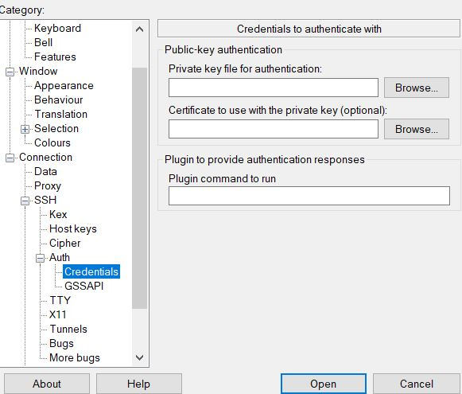

5. Nachdem Sie die IP-Adresse der VM eingegeben haben und die Schlüsselpaare an den richtigen Ort platziert, haben können Sie eine sichere SSH-Verbindung aufbauen. 

##  FTP Installation (optional)
1. Mit 
    ```bash
    sudo apt install vsftpd
    ```
    installieren Sie den FTP-Server auf der virtuellen Umgebung


   
2. Installieren Sie auf Ihrem Windows oder MacOS den FTP-CLient.
Hierzu beachten den Filezilla-CLient nicht den Filezilla-Server.
https://filezilla-project.org/

3. Nachdem Sie das getan haben, geben Sie bei ``Server`` sftp://IP-Adresse (sftp für das SSH Transfer Protokoll über Port 22) Ihren Benutzernamen und Ihr Passwort. 

    ***Hinweis:* Wenn Sie die Passwortoption in der SSH-Config Datei auf No gestellt haben, sollten Sie diese kurzzeitig auf Yes stellen, sonst wird Ihnen der Zugang verweigert.**


##  Apache2 Installation
1. Installieren Sie den Webserver Apache2 mit dem Befehl:
    ```bash
    sudo apt install apache2
    ```
    


2. Nach erfolfreicher Installation von Apache2 sollte bei öffnen des localhosts diese Seite zusehen sein: 


##  Installation MariaDB
1. Installieren Sie MariaDB mit dem Befehl:
    ```bash
    sudo apt install mariadb-server mariadb-client
    ```
2. Starten Sie MariaDB mit:
    ```bash
    sudo systemctl Start Mariadb 
    ```
3. Damit der Dienst auch beim booten wieder aktiv ist führen Sie den command aus:
    ```bash
    sudo systemctl enable mariadb
    ```
4. Mit ``systemctl status mariadb`` können Sie den Status prüfen.
5. Führen Sie diesen Schritt bitte als Root-User aus. Desweiteren müssen Sie die Sicherheitskonfigs von MariaDB anpassen. Installieren Sie dafür mysql_secure_installation mithilfe von

    ```bash
    sudo su 
    ```
    ```bash
    mysql_secure_installation
    ```
    Nach der Installation werden Sie nach diesen Einstellungen gefragt:
    * **Root-Passwort festlegen:** Falls noch nicht gesetzt.
    * **Anonyme Benutzer entfernen:** Y eingeben, um sie zu entfernen.
    * **Root-Login über Remote deaktivieren:** Y eingeben, falls lokal verwendet wird.
    * **Testdatenbanken entfernen:** Y eingeben, um sie zu löschen.
    * **Rechte neu laden:** Y eingeben.
6. Erstellen Sie eine Datenbank, Benutzernamen und ein Passwort, womit Sie im Nachhinein das ganze mit WordPress verknüpfen.
    ```SQL
    CREATE DATABASE beispieldatenbank;
    CREATE USER 'benutzername' IDENTIFIED BY 'passwort';
    GRANT ALL PRIVILEGES ON beispieldatenbank.* TO 'benutzername';
    FLUSH PRIVILEGES;
    ```

##  Firewall aktivieren
Aktivieren Sie die Firewall, um eingehenden und ausgehenden Netzwerkverkehr zu kontrollieren und Regeln für den Zugriff festzulegen.

1. Prüfen Sie mit status ufw ob die Firewall aktiviert ist. Falls nicht aktivieren Sie die Firewall mit 
    ```bash
    ufw enable 
    ```
2. Setzen Sie die Regel ``ufw allow 80`` und ``ufw allow 443``, um den Zugriff auf HTTP (Port 80) und HTTPS (Port 443) zu ermöglichen.

##  PHP Installation
1. Installieren Sie PHP um Anwendungen basierend auf PHP benutzen zu können. 
    ```bash
    sudo apt update
    sudo apt install php libapache2-mod-php php-mysql
    ```

##  Wordpress Installation
1. Gehen Sie in das Apache2-Root Verzeichnis ``/var/www/html`` Verzeichnis und führen Sie folgenden Befehl aus: 
    ```bash
    wget https://wordpress.org/latest.tar.gz
    tar -xvzf latest.tar.gz hiermit entpacken Sie die Wordpress-Datei.
    -z: Entpackt das Gzip-Archiv (.gz).
    -x: Extrahiert die Datei.
    -v: Zeigt den Fortschritt (welche Dateien extrahiert werden).
    -f latest.tar.gz: Arbeitet mit der angegebenen Archivdatei latest.tar.gz.
    ```
2. Verschieben Sie im Wordpress Ordner alle Dateien einschließlich versteckter Dateien ins HTML Verzeichnis mit dem Befehl:
    ```bash
    sudo mv /var/www/html/wordpress/* /var/www/html
    ```
3. Gehen Sie mit ``cd ..`` ins HTML Verzeichnis und überprüfen Sie mit ``ls -al``, ob alle Dateien und die .htaccess vorhanden sind. 
In dem Verzeichnis ist eine Datei namens ``wp-config-sample.php``. Ändern Sie den Dateinamen mit dem Befehl 
    ```bash
    mv wp-config-sample.php wp-config.php
    ```
4. Bearbeiten Sie die Datei mit dem Befehl 
    ```bash
    sudo nano wp-config.php
    ```
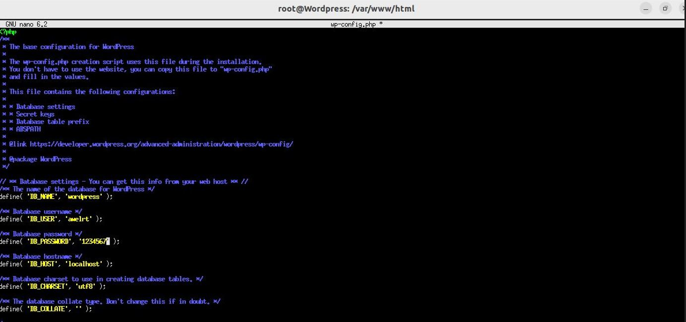

5. Geben Sie in dieser Datei die Daten an, die Sie bei der Datenbank Erstellung angegeben haben. 
6. Sobald Sie mit den Einstellungen in den Konfigdateien fertig sind, müssen Sie auf Firefox in der URL-Leiste "localhost/wp-admin" eintippen. 


    **Wenn Sie das Bild sehen haben Sie erfolgreich Ihre Datenbank mit Wordpress angebunden.**

## Integrierung der Subdomain (optional)
Sollten Sie über eine Subdomain verfügen, können Sie diese in der wp-config.php Datei einbetten. 
   ```php
   $servername = "localhost";
   $username = "Ihr_Datenbankbenutzer";
   $password = "Ihr_Passwort";
   $dbname = "Ihr_Datenbankname";
   define('DB_COLLATE', '');
   ```  
Gehen Sie 2-3 Zeilen unter "define DB_Collate" und geben Sie den kommenden Abschnitt ein: 

```php
define('WP_SITEURL', 'https://deinedomain.de');
define('WP_HOME', 'https://deinedomain.de');
```

Des Weiteren wechselen Sie ins Verzeichnis /etc/apache2/sites-available und erstellen mit   ```bash
sudo nano deinedomain.de.conf
    ``` eine neue Datei überschreiben Sie die Servernamen mit Ihrer Subdomain aus dem folgendem Bild: 

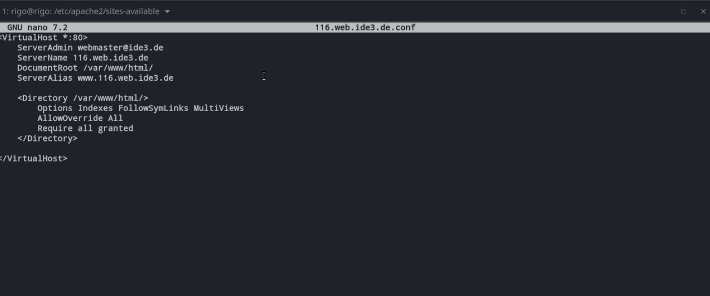

Nun sollte Wordpress über Ihre Subdomain laufen.

##  Dateibereichtigung erteilen
Ganz wichtig hierbei ist, dass Sie die erfoderlichen Dateibereichtigungen setzen, damit Sie auf Plugins und Themes zugreifen können. 

Mit dem Befehl 
```bash
sudo chown -R www-data:www-data /var/www/html 
```
erteilen Sie dem Verzeichnis Schreibrechte. ``www-data:www-data`` ist ein Benutzer. Unter dem Benutzer laufen auch die Webserver. Es ist durchaus wichtig das diese Bereichtigung gesetzt wird, damit der Webserver (in dem Falle Apache2) ordnungsgemäß auf die Dateien zugreifen kann. 

##  Installation von Elementor (optional)
Fügen Sie bei Wordpress das Plugin Elementor hinzu und aktivieren Sie dieses. Somit können Sie verschiedene Seite auf einer kreativen Art und Weise bearbeiten. Es ist auch Nutzfreundlicher als andere Baukasten. 


Gehen Sie mit Elementor in den Bearbeitungmodus. Auf der rechten Seite haben Sie verschiedene Optionen um die Seite zu bearbeiten. Suchen nach "shortcode" und fügen Sie Ihren Shortcode auf den jeweiligen Seiten hinzu. Es sollte wie im folgendem Bild aussehen: 

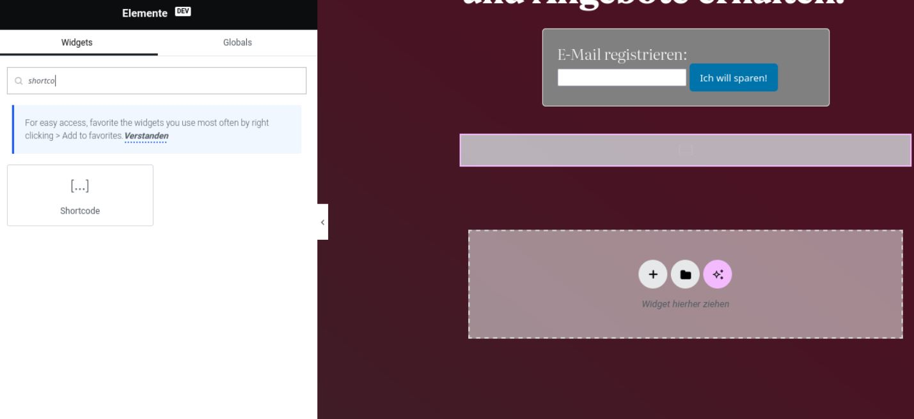

##  Installation von einem Theme
Dieser Schritt sollte nicht länger als 5 Minuten in Anspruch nehmen:
1. Wählen Sie ein Theme unter dem Menüpunkt ``Design`` in WordPress aus, um eine Frontpage zu erstellen.
2. Aktivieren Sie das ausgewählte Theme, öffnen Sie anschließend Ihre Webseite und überprüfen Sie, ob das Theme korrekt übernommen wurde.

Sie müssen an der Frontpage keine weiteren Änderungen vornehmen. Sollten Sie jedoch früher fertig sein, können Sie die Frontpage nach Belieben anpassen oder die WordPress-Tools ausprobieren.

##  Einrichtung von benötigten Seiten
1. Zunächst müssen Sie im WordPress-Dashboard zum Menüpunkt ``Seiten`` navigieren. Dort erstellen Sie bitte die folgenden Seiten mit den jeweiligen Einstellungen:
    ```
    * Forum: Diese Seite bitte auf „Privat“ setzen.
    * Kalender: Diese Seite auf „Passwortgeschützt“ setzen. Merken Sie sich das Passwort oder schreiben Sie es auf. Im Notfall können Sie das Passwort später über die QuickEdit-Funktion der Seite nachschauen.
    * DeadDrop: Ebenfalls auf „Passwortgeschützt“ setzen.
    * Newsletter: Diese Seite bleibt öffentlich.
    ```
    Diese Seiten werden in späteren Schritten benötigt.

##  Installation Kalender

1. **Plugin installieren und aktivieren**
    Installieren und aktivieren Sie das Plugin The Events Calendar.

2. **Menüpunkt "Veranstaltungen" finden**

    Nach der Aktivierung erscheint im linken Bereich des WordPress-Dashboards der Menüpunkt Veranstaltungen. Klicken Sie darauf.

3. **Veranstaltungsübersicht**

    Sie sehen nun eine Liste aller geplanten Veranstaltungen. Wenn Sie noch keine Veranstaltungen erstellt haben, ist die Liste leer.

4. **Neue Veranstaltungen hinzufügen**

    Fügen Sie mindestens eine Veranstaltung hinzu, um später überprüfen zu können, ob der Kalender die Events korrekt anzeigt.

5. **Seite "Kalender" bearbeiten**

    Öffnen Sie die im vorigen Schritt erstellte Seite Kalender und klicken Sie auf Webseite bearbeiten. Fügen Sie ein Widget mit dem Namen Events List hinzu, das Ihre Veranstaltungen anzeigt.

6. **Speichern und testen**
    
    Speichern Sie die Seite und öffnen Sie sie anschließend, um zu überprüfen, ob die Veranstaltungen korrekt angezeigt werden.

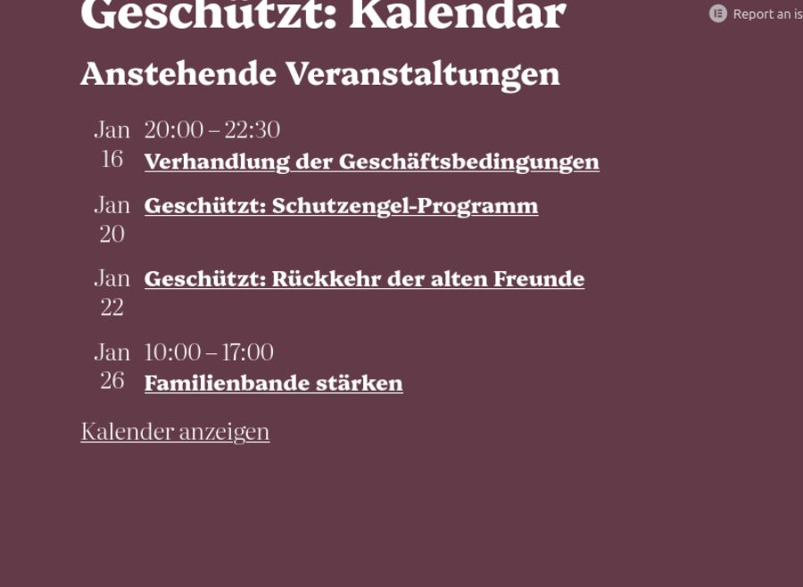{ width=50% }

---- 

##  Installation Chat
1. Installieren Sie das Plugin „Better Messages“ über den Plugin-Store und aktivieren Sie es.
2. Nach der Aktivierung sollte im Dashboard ein neuer Menüpunkt ``Better Messages`` erscheinen.
3. Unter diesem Menüpunkt können Sie die Einstellungen für Ihren Chat anpassen. Sie können die Standardeinstellungen übernehmen oder nach Bedarf Änderungen vornehmen.

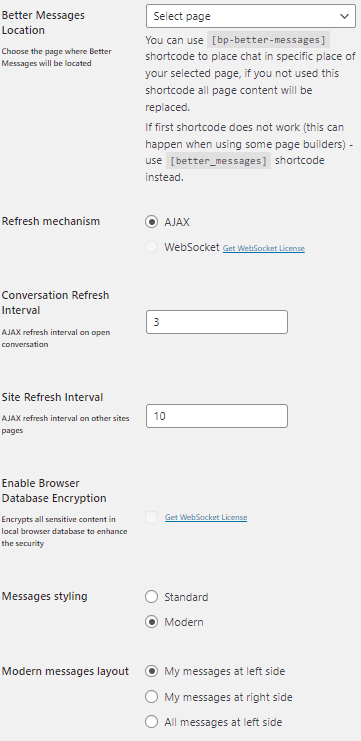{ width=50% }
    
{ width=50% }

4. Öffnen Sie die zuvor erstellte Seite ``Forum``, fügen Sie einen Shortcode-Block hinzu und tragen Sie den folgenden Shortcode ein:
    ```
    [bp-better-messages]
    ```

***Hinweis:* Falls der Chat nicht angezeigt wird, ersetzen Sie den Shortcode ``[bp-better-messages]`` durch ``[better_messages]`` und laden Sie die Seite neu.**

***Hinweis:* Gehen Sie mit Elementor in den Bearbeitungmodus. Auf der rechten Seite haben Sie verschiedene Optionen um die Seite zu bearbeiten. Suchen nach "shortcode" und fügen Sie Ihren Shortcode auf den jeweiligen Seiten hinzu.**

Es sollte wie im folgendem Bild aussehen:

##  Installation Deaddrop-Sytem
1. Im Git-Repository finden Sie eine .php-Datei mit dem Namen ``Deaddrop``. Laden Sie diese Datei herunter.
2. *Öffnen Sie das Terminal Ihrer virtuellen Maschine und fügen Sie die .php-Datei in den Plugin-Ordner Ihrer WordPress-Website ein.* 
Verwenden Sie dafür die folgenden Befehle:
    ```bash
    mv /var/www/html/wp-content/plugins
    ```
    Mit ``mv`` fügen Sie das PHP Skript in den Plugin Ordner. 
3. Aktualisieren Sie Apache2 mit dem Befehl
    ```bash
    sudo systemctl reload apache2
    ``` 
4. Gehen Sie auf Wordpress zu den Plugins. Je nachdem wie Sie sie benannt haben, sollte es dort auftauchen. 
5. Aktivieren Sie das Plugin.  
6. Öffnen Sie die zuvor erstellte ``"DeadDrop""-Seite`` im WordPress-Dashboard. Fügen Sie einen Shortcode-Block hinzu und tragen Sie den folgenden Shortcode ein:
    ```
    [dead_drop]
    ```
7. Speichern Sie die Seite und laden Sie die Seite neu. Das Dead-Drop-System sollte nun angezeigt werden.

***Hinweis:* Gehen Sie mit Elementor in den Bearbeitungmodus. Auf der rechten Seite haben Sie verschiedene Optionen um die Seite zu bearbeiten. Suchen nach "shortcode" und fügen Sie Ihren Shortcode auf den jeweiligen Seiten hinzu.**

##  Cowrie Installation
Anleitung zur Installation und Einrichtung von Cowrie Honeypots:
1. **System aktualisieren**
    Führen Sie die folgenden Befehle aus, um das System auf den neuesten Stand zu bringen:
    ```bash
    sudo apt update && sudo apt upgrade -y
    ```
2. **Notwendige Pakete installieren**

    Installieren Sie alle erforderlichen Pakete, die Cowrie benötigt. Geben Sie dazu den folgenden Befehl ein:
    ```bash
    sudo apt install git python3 python3-venv python3-pip libssl-dev libffi-dev build-essential -y
    ```

3. **Cowrie von GitHub herunterladen**

    Laden Sie die Cowrie-Software aus dem offiziellen GitHub-Repository herunter:
    ```bash
    git clone https://github.com/cowrie/cowrie.git
    ```
4. **Ins Cowrie-Verzeichnis wechseln**

    Wechseln Sie in das Verzeichnis, das durch das Herunterladen des Repositories erstellt wurde:
    ```bash
    cd cowrie
    ```
5. **Virtuelle Umgebung für Cowrie erstellen**

    Erstellen Sie eine virtuelle Umgebung, um Cowrie und seine Abhängigkeiten zu isolieren:
    ```bash
    python3 -m venv cowrie-env
    ```
6. **Virtuelle Umgebung aktivieren**

    Aktivieren Sie die erstellte virtuelle Umgebung mit dem folgenden Befehl:
    ```bash
    source cowrie-env/bin/activate
    ```
7. **Pip aktualisieren**

    Aktualisieren Sie den Python-Paketmanager pip in der virtuellen Umgebung:
    ```bash
    pip install --upgrade pip
    ```
8. **Python-Abhängigkeiten installieren**

    Installieren Sie alle notwendigen Python-Abhängigkeiten, die Cowrie benötigt:
    ```bash
    pip install -r requirements.txt
    ```
9. **Konfigurationsdatei erstellen**

    Kopieren Sie die Standardkonfigurationsdatei und erstellen Sie Ihre eigene benutzerdefinierte Konfiguration:
    ```bash 
    cp etc/cowrie.cfg.dist etc/cowrie.cfg
    ```
10. **Konfigurationsdatei bearbeiten**

    Bearbeiten Sie die Konfigurationsdatei mit einem Texteditor Ihrer Wahl, z. B. nano:
    ```bash
    nano etc/cowrie.cfg
    ```
    In der Datei können Sie Cowrie so konfigurieren, dass es auf einem bestimmten Port lauscht, z. B.:
    ```bash
    listen_endpoints = tcp:2222:interface=0.0.0.0
    ```

    { width=50% }


11. **Zugangsdaten und Hostname fälschen**
    Erstellen Sie eine Datei namens userdb.txt im Verzeichnis etc und fügen Sie gefälschte Zugangsdaten hinzu. Sie können auch den Hostnamen anpassen, damit Cowrie wie ein echter Server wirkt: ``hostname = your-webserver``


    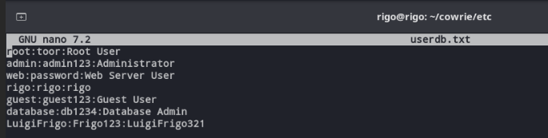{ width=50% }

12. **Cowrie starten**

    Starten Sie Cowrie mit folgendem Befehl in das Terminal ein:
    ```bash
    bin/cowrie start
    ```
13. **Cowrie-Status prüfen**

    Überprüfen Sie, ob Cowrie korrekt läuft:
    ```bash
    bin/cowrie status
    ```
14. **Logs überprüfen**

    * Letzte Logs anzeigen: Zeigt die letzten 50 Zeilen der Log-Datei an:**
        ```bash
        tail -n 50 var/log/cowrie/cowrie.log
        ```

    * Live-Überwachung der Logs: Zeigt die Logs in Echtzeit: 
        ```bash
        tail -f var/log/cowrie/cowrie.log
        ```
    * JSON-Logs prüfen: Überwachen Sie die JSON-Logs in Echtzeit: 
        ```bash
        tail -f var/log/cowrie/cowrie.json
        ```


##  Aufbau eines Token-basierten Authentifizierungssystems
Diese Anleitung erklärt, wie Sie die bereitgestellten PHP-Skripte einrichten und ein Token-basiertes Authentifizierungssystem implementieren. Folgen Sie den Schritten, um das System erfolgreich zu konfigurieren.

###  Skripte in das Hauptverzeichnis des Webservers einfügen
Zunächst müssen die benötigten Skripte in das Hauptverzeichnis des Webservers geladen werden. Das Hauptverzeichnis befindet sich im Pfad `/var/www/html/`.

###  Schritt-für-Schritt-Anleitung
1. Navigieren Sie in das Verzeichnis `/var/www/html/`, welches das Hauptverzeichnis für die Webseiten-Dateien ist.  
2. Laden Sie die folgenden Dateien in dieses Verzeichnis hoch:  
        * `custom-login2.php`  
        * `db_connection.php`  
        * `protected-page.php`  
        * `tokenlog.php`  
        * `verify-token.php`  
        * `token-login.html`  
3. Überprüfen Sie anschließend, ob alle Dateien korrekt im Verzeichnis vorhanden sind.

###  HTML-Skript für den Login-Button in die gewünschte Webseite einfügen
Das nächste Ziel besteht darin, einen ``Login-Button`` auf einer WordPress-Seite zu platzieren. Hierfür benötigen Sie ein HTML-Skript, welches auf der Webseite ``Newsletter`` eingefügt werden muss.

1. Loggen Sie sich in das WordPress-Dashboard ein und gehen Sie zu dem Menüpunkt ``Seiten``.  
2. Wählen Sie die Seite aus, auf der der Login-Button eingefügt werden soll, und öffnen Sie diese im Bearbeitungsmodus.  
3. Wechseln Sie in den **HTML-Editor** oder fügen Sie einen **Custom-HTML-Block** hinzu, wenn Sie den Elementor verwenden.  
4. Fügen Sie das HTML-Skript für den ``Login-Button`` in das Bearbeitungsfeld ein.
5. Speichern Sie die Änderungen und veröffentlichen Sie die Seite erneut.  
6. Öffnen Sie die Seite im Browser und überprüfen Sie, ob der Login-Button korrekt angezeigt und funktional ist.


###  Installation und Aktivierung des WP Mail SMTP Plugins
Damit der Webdienst E-Mails versenden kann, muss das Plugin ``WP Mail SMTP`` installiert und eingerichtet werden.

1. Melden Sie sich in Ihrem ``WordPress-Dashboard`` an und klicken Sie auf den Menüpunkt ``Plugins`` > ``Installieren``.  
2. Nutzen Sie die Suchfunktion, um nach dem Plugin ``WP Mail SMTP`` zu suchen.  
3. Sobald das Plugin gefunden wurde, klicken Sie auf ``Installieren`` und danach auf ``Aktivieren``.  

###  Einrichtung des Plugins mithilfe des Setup-Assistenten
1. Nach der Aktivierung des Plugins öffnen Sie die Einstellungen unter ``WP Mail SMTP`` im Dashboard.  
2. Starten Sie den ``Setup-Assistenten``, der Sie Schritt für Schritt durch die Konfiguration führt.  
3. Wählen Sie als E-Mail-Service ``Gmail`` aus, um den Mailversand über ein Gmail-Konto zu ermöglichen.  

###  Einrichtung der Gmail API in der Google Cloud Console
Für den Versand von E-Mails über Gmail benötigen Sie Zugangsdaten, die in der ``Google Cloud Console`` erstellt werden. Hierbei handelt es sich um die ``Client-ID`` und den ``Client-Schlüssel``.

1. Öffnen Sie die [Google Cloud Console](https://console.cloud.google.com/) und melden Sie sich mit Ihrem Gmail-Account an.  
2. Erstellen Sie ein neues Projekt, indem Sie auf ``Projekt erstellen`` klicken und einen Projektnamen eingeben.  
3. Sobald das Projekt erstellt wurde, öffnen Sie es in der Konsole.  
4. Navigieren Sie zu ``APIs & Dienste`` > ``Bibliothek``.  
   - Suchen Sie hier nach der ``Gmail API`` und aktivieren Sie diese.  
5. Gehen Sie anschließend zu ``APIs & Dienste`` > ``Anmeldedaten`` und klicken Sie auf ``Anmeldedaten erstellen``.  
   - Wählen Sie als Typ ``OAuth-Client-ID`` aus.  
6. Falls nötig, konfigurieren Sie den ``Zustimmungsbildschirm``:  
   - **User-Typ**: Extern  
   - **Anwendungsname**: Zum Beispiel „Mail-System“  
   - **Nutzersupport-E-Mail**: Ihre E-Mail-Adresse  
   - **Startseite der Anwendung**: URL Ihrer Webseite  
   - **Domain hinzufügen**: Ihre Domain  
   - **Kontaktdaten des Entwicklers**: Ihre E-Mail-Adresse  
7. Wählen Sie unter ``Bereiche hinzufügen``:  
   - `../auth/gmail.send` → Zum Senden von E-Mails über das Gmail-Konto  
   - `../auth/userinfo.email` → Zum Auslesen der E-Mail-Adresse  
8. Speichern Sie die Konfiguration.  
9. Nach dem Abschluss erhalten Sie die ``Client-ID`` und den ``Client-Schlüssel``.

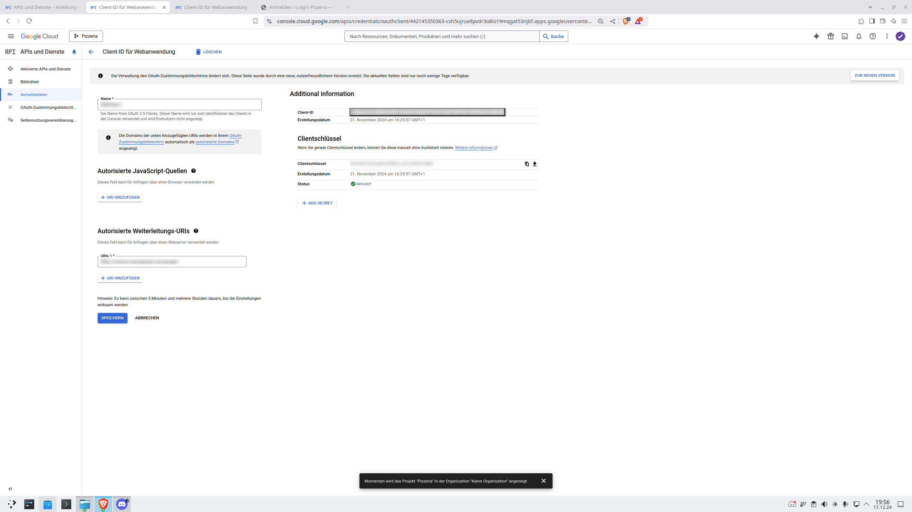{ width=50% }

###  Konfiguration des WP Mail SMTP Plugins mit der Gmail API
1. Öffnen Sie die Einstellungen des Plugins ``WP Mail SMTP`` in WordPress.  
2. Starten Sie den ``Setup-Assistenten`` erneut, falls nötig.  
3. Wählen Sie ``Gmail`` als Mailer aus.  
4. Tragen Sie die ``Client-ID`` und den ``Client-Schlüssel** ein, die Sie zuvor in der Google Cloud Console erstellt haben.  
5. Speichern Sie die Einstellungen.  
6. Testen Sie die Verbindung, indem Sie eine **Test-E-Mail** senden.

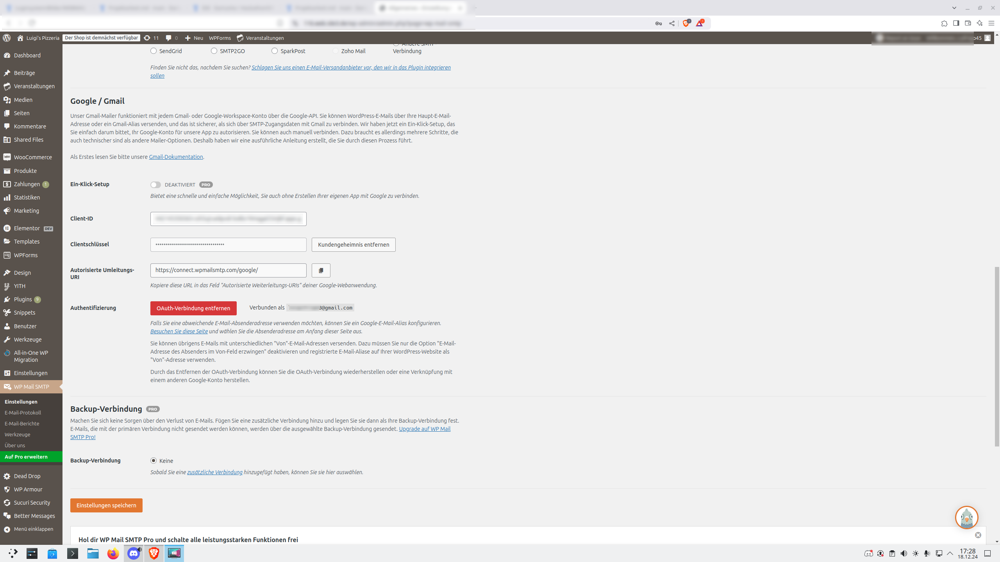{ width=50% }

###  Datenbanktabellen vorbereiten
Die Webseite benötigt eine zusätzliche Tabelle für die **Token-Verwaltung**. Diese Tabelle heißt `login_tokens`.

1. Melden Sie sich in Ihrer MySQL-Datenbank an (z. B. über phpMyAdmin oder Terminal).
2. Führen Sie die folgende SQL-Anweisung aus, um die Tabelle `login_tokens` in Ihrer WordPress-Datenbank zu erstellen:

```sql
CREATE TABLE login_tokens (
    id INT AUTO_INCREMENT PRIMARY KEY,
    user_id INT NOT NULL,
    token VARCHAR(64) NOT NULL,
    expiry DATETIME NOT NULL,
    FOREIGN KEY (user_id) REFERENCES wp_users(ID) ON DELETE CASCADE
);
```  
3. Stellen Sie sicher, dass die Tabelle `wp_users` existiert und die Spalte ``user_email`` enthält.

###  Snippet-Plugin installieren und konfigurieren
1. Gehen Sie in WordPress zu ``Plugins`` > ``Installieren``.  
2. Suchen Sie nach dem Plugin ``Snippets``.  
3. Installieren und aktivieren Sie das Plugin.

#### **Snippet-Skripte einfügen**
1. Öffnen Sie das Plugin ``Snippets`` und klicken Sie auf ``Neues Snippet hinzufügen``.  
2. Fügen Sie nacheinander ``Snippet-Skript 1`` und ``Snippet-Skript 2`` ein.  
3. In ``Snippet-Skript 1``, Zeile 4, ersetzen Sie die Seiten-IDs:  
   ```php
   $protected_page_ids = array(583, 530, 528); // Ersetzen Sie diese IDs
   ```  
4. Um die Seiten-IDs zu finden, bewegen Sie in WordPress den Mauszeiger über den Seitennamen. Die Seiten-ID erscheint in der URL unten im Browser.  
5. Speichern Sie beide Snippets.

###  Datenbank-Verbindung einrichten
1. Öffnen Sie die Datei `db_connection.php`.  
2. Fügen Sie Ihre Datenbank-Zugangsdaten ein:  
   ```php
   $servername = "localhost";
   $username = "Ihr_Datenbankbenutzer";
   $password = "Ihr_Passwort";
   $dbname = "Ihr_Datenbankname";
   ```  
3. Speichern Sie die Datei.

###  Skript-Verweise überprüfen
1. Stellen Sie sicher, dass die Skripte korrekt miteinander verlinkt sind:  
   - `db_connection.php` wird in mehreren Skripen verwendet.  
   - `protected-page.php` verweist auf die jeweils durch das T0ken geschützten Seiten.  
   - Login-Button HTML-SKript verweist auf `custom-login2.php`

##  Notschalter
Setzen Sie zur Ihrer eigenen Sicherheit diese Einstellung um: 
```bash
sudo visudo
``` 
und setzten Sie die Einstellung ``Defaults  timestamp_timeout=0``. Dieser Schritt wird auch schon oben am Anfang der Installationsanleitung beschrieben. 

1. Erstellen des Notschalter -Skripts:
    Im Terminal: 
    ```bash
    cd ~/ #ins gewünschte Verzeichnis gehen#
    mkdir Notschalter
    cd Notschalter
    ```
    Danach die Datei erstellen: 
    ```bash
    sudo nano Notschalter.sh
    ```
    Folgenden Code in die Datei schreiben:
    
{ width=50% }

2. Danach speichern und schließen.
3. Berechtigungen setzen: 

    ```bash
    sudo chmod 644 Notschalter.sh
    ```

    Erklärung vom chmod-Befehl: 6 (rw-): Lesen und Schreiben für den Besitzer; 4 (r--): Nur Lesen für die Gruppe; 4 (r--): Nur Lesen für andere Benutzer.
    Ausführen des Skripts: in das richtige Verzeichnis wechseln: cd ~/Notschalter, danach das Skript ausführen: sudo ./Notschalter.sh

    Das Ergebnis sollte so aussehen: 

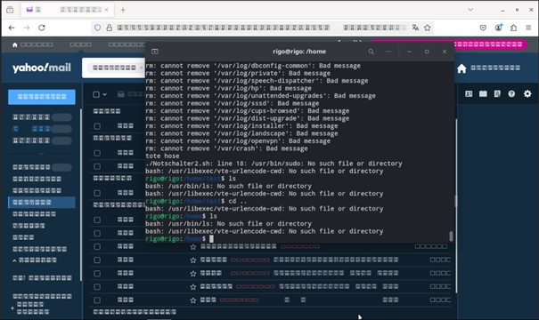{ width=50% }

    Es sind keine commands mehr ausführbar, fonts sind unbrauchbar, praktisch das ganze Betriebssystem ist vernichtet. 


###  Implementierung der Blockchain in die Webseite

Erstellen Sie einen neuen Ordner im Home-Verzeichnis. Legen Sie in diesem Verzeichnis eine neue Datei an, beispielsweise „blockchain_server.py“. Diese Datei wird die Verbindung zwischen Flask und WordPress herstellen. Verwenden Sie den Code von "Blockchain_server.py". 

Führen Sie bitte die nächsten Schritte im erstellen Ordner aus und geben Sie dem Ordner Besitzerrechte.
```bash
sudo chown rigo:rigo /home/rigo/blockchain
```
Falls noch nicht geschehen, installieren Sie die erforderlichen Pakete mit dem folgenden Befehl:
```bash
sudo apt install python3 python3-pip
```
Dabei wird Python 3 sowie die neueste Version von pip installiert.

Installieren Sie zusätzlich das Modul zur Erstellung virtueller Umgebungen mit:
```bash
sudo apt install python3-venv
```
Erstellen Sie anschließend eine virtuelle Umgebung mit dem Befehl:
```bash
python3 -m venv venv
```
Aktivieren Sie die Umgebung mit:
```bash
source venv/bin/activate
```
Als nächstes ist es erforderlich, Flask zu installieren. Flask ist ein Framework, das dazu dient, Python-Skripte als Web-API bereitzustellen, in diesem Fall für die Kommunikation mit WordPress. Installieren Sie Flask mit:
```bash
pip install flask
```
Um die Sicherheit der Verbindung zu gewährleisten, erstellen Sie ein SSL-Zertifikat. Ohne ein solches Zertifikat kann es zu Problemen kommen, da die Webseite als unsicher eingestuft werden könnte. Bitte generieren Sie das Zertifikat im selben Verzeichnis in dem Ihre Blockchain_server.py liegt. Verwenden Sie dazu folgenden Befehl:
```bash
openssl req -x509 -newkey rsa:4096 -keyout key.pem -out cert.pem -days 365 -nodes
```
Da der Flask-Server und die WordPress-Seite auf unterschiedlichen Hosts laufen, ist die Installation von CORS erforderlich. Dies ermöglicht die Kommunikation zwischen verschiedenen Domains. Installieren Sie flask-cors mit:
```bash
pip install flask-cors
```
Kopieren Sie das erstellte SSL-Zertifikat in das Verzeichnis für Zertifikate mit:
```bash
sudo cp cert.pem /usr/local/share/ca-certificates/mycert.crt
```
Aktualisieren Sie die Zertifikate mit:
```bash
sudo update-ca-certificates
```
Um zu überprüfen, ob das SSL-Zertifikat erfolgreich erstellt wurde, führen Sie den folgenden Befehl aus:
```bash
curl -i -X GET https://192.168.1.116:5000/blocks
```


Starten Sie abschließend den Flask-Server mit:
```bash
python3 blockchain_server.py
```


Erstellen Sie eine neue Wordpress Seite. Falls Sie Elementor installiert haben, fügen Sie einen HTML-Shortcode ein und fügen den Code "Blockchain_frontend.html" ein. 

Ersetzen Sie die URLs https://192.168.1.116:5000/blocks und https://192.168.1.116:5000/add_block durch die API-URLs Ihres Projekts.

Wenn Sie alles richtig installiert und programmiert haben sollte es so aussehen: 


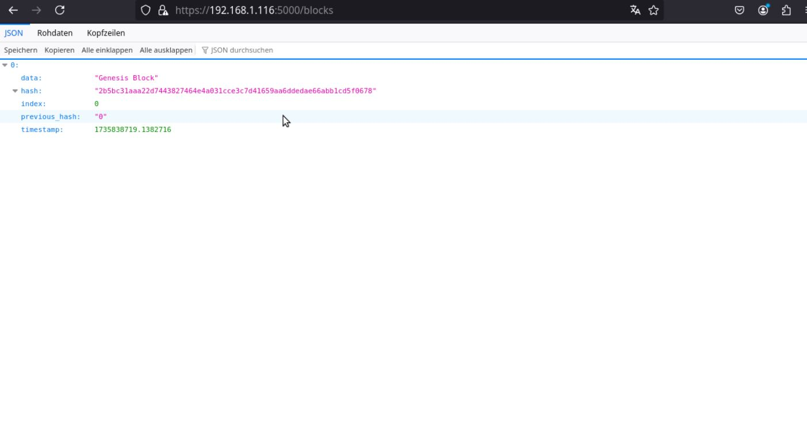

**Wichtige Syntax und Anpassungshinweise:**

**CORS-Aktivierung:**
```python
CORS(app, resources={r"/*": {"origins": "*"}})
```
* Ermöglicht API-Zugriff von beliebigen Clients.
* Anpassung: {"origins": "*"} auf spezifische Domains beschränken, z. B. {"origins": "https://example.com"}. Wir haben es nicht spezifisch auf unsere Domäne beschränkt (116.web.ide3.de) da es zu Fehler gekommen ist und die Zeit zu Debuggen war auch nicht mehr da.

**Weitere Blocks-Hinzufügen:**
```python
def add_block():
    data = request.json.get("data", "")
    blockchain.add_block(data)
```
* Fügt einen Block basierend auf der gesendeten JSON-Nachricht hinzu.
* Anpassung: data-Feld anpassen, falls spezifische Datenstrukturen erforderlich sind.

**Blockchain-Validierung:**
```python
def is_chain_valid():
    return jsonify({"is_valid": blockchain.is_chain_valid()})
```
* Überprüft, ob die Blockchain konsistent und unverändert ist.
* Anpassung: Keine Änderungen nötig, da dies universell funktioniert.

**Server-Konfiguration:**
```python
app.run(host="0.0.0.0", port=5000, ssl_context=('cert.pem', 'key.pem'))
```
* Startet die API mit SSL-Verschlüsselung.