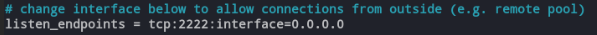

# Formales

## Angaben zum Projekt

- **Datum:** 17.01.2025
- **Projektname**: A (Digital) Family Business
- **Gruppennummer**: Gruppe 6.1.
- **Namen der Gruppenmitglieder und deren Verantwortlichkeiten**:
  * Marcel Montaner, 000000, Informationsrecherche und Dokumentation
  * Finn Schmitz, 000000, Backend, Honeypot, dokumentiert             
  * Shpend Shaqitira, 000000, Login-System, Token-System, Backend, dokumentiert und formatiert      
  * Melissa Gehl, 00000, Design von der Website, Implementierung von Deaddrop-System, Kalender und Forum, dokumentiert 
  * Darius Haghighi Najafabadi, 1349455, Projektleiter, Backend, Frontend, Blockchain, Apache2, MariaDB, Wordpress, SSH, Killswitch, dokumentiert und formatiert
  * Jakub Kämmer, 00000, Backend, Honeypot, SSH, Killswitch, dokumentiert und formatiert

-----------------------


#  Motivation
Luigi Frigo, ein aufstrebender, jedoch bislang unbekannter Mafiaboss, plant, sein Familienunternehmen zu modernisieren und ins digitale Zeitalter zu überführen. Das Ziel dabei ist es, die betrieblichen Prozesse seines „Unternehmens“ global zu koordinieren, während absolute Geheimhaltung gewahrt bleibt, um nicht die Aufmerksamkeit von Strafverfolgungsbehörden oder rivalisierenden Gruppen auf sich zu ziehen. Luigi hat sich an Ihr Cybersicherheitsunternehmen gewandt, um einen hochsicheren Webdienst entwickeln zu lassen, der diese Anforderungen erfüllt. Dies bietet Ihrem Unternehmen die Gelegenheit, seine Expertise in fortschrittlichen Cybersicherheitslösungen, sicherer Softwareentwicklung und der Gestaltung verdeckter Systeme unter Beweis zu stellen. Gleichzeitig ist das Projekt eine spannende Herausforderung, die kreatives Denken und die Anwendung modernster Technologien erfordert. Da Luigi von den Ergebnissen dieses Projekts überzeugt werden muss, ist es für Ihr Unternehmen von strategischer Bedeutung, höchste Motivation und Engagement zu zeigen.

#  Aufgabenstellung
Die zentrale Aufgabe besteht darin, einen verdeckten und hochsicheren Webdienst zu entwickeln, der es Luigi Frigo ermöglicht, seine globalen Geschäfte diskret zu verwalten. Der Dienst muss verschiedene Module umfassen, die sowohl Sicherheits- als auch Geheimhaltungsanforderungen erfüllen:
1. Benutzerauthentifizierungssystem mit glaubhafter Abstreitbarkeit, das es ermöglicht, Funktionen und Daten bei einer möglichen Überprüfung durch Behörden auf legitime Weise zu erklären.
2. Verschlüsselte Kommunikationskanäle, die selbstzerstörende Nachrichten für die interne Kommunikation innerhalb des „Familienunternehmens“ ermöglichen.
3. Terminplaner, der zur Organisation von Treffen mit rivalisierenden Familien dient.
4. Sicheres „Dead-Drop“-System, das den Austausch sensibler Dokumente ermöglicht.

Zusätzlich wird erwartet, dass das System durch kreative Lösungen erweitert wird, um weiteren geschäftlichen Anforderungen gerecht zu werden. Dazu könnte die Implementierung von Blockchain-Technologie zur Nachverfolgung von Beiträgen lokaler Unternehmen gehören. Zu den technologischen Grundlagen sollen Zero-Knowledge-Proofs, homomorphe Verschlüsselung, Steganographie und Honeypot-Systeme gehören.
Die Umsetzung erfolgt in einer virtuellen Umgebung, und das Projekt wird über Git verwaltet. Im Laufe des Projekts sollen alle Arbeitsschritte von der Anforderungsanalyse über den Systementwurf bis hin zu Implementierung, Testing und Dokumentation strukturiert und in einem Zeitplan festgehalten werden. Sicherheitsanforderungen und entsprechende Schutzmaßnahmen gegen potenzielle Bedrohungen müssen ebenfalls von Beginn an in den Entwurfsprozess integriert werden.

#  Entwurf 

##  Zweck
Der Zweck dieser Aufgabe besteht darin, dass wir unser Verständnis und unsere Fähigkeiten im Bereich der Cybersicherheit vertiefen und auf ein praxisnahes, wenn auch fiktives Szenario anwenden. Dabei geht es darum, hochsichere und verdeckte Lösungen zu entwickeln, die sowohl den Anforderungen an Geheimhaltung als auch an moderne digitale Sicherheitspraktiken gerecht werden. Es erlaubt uns zu erlernen, wie wir glaubhafte Abstreitbarkeit in Systeme integrieren, die sowohl die eigentliche Funktion verdecken als auch plausible Erklärungen bieten, falls sie von Dritten überprüft werden.

Außerdem setzen wir uns intensiv mit fortgeschrittenen Authentifizierungsmethoden auseinander, insbesondere mit der Technik des Zero Knowledge Proof. Ein weiterer wichtiger Aspekt für dieses Projekt, ist die verschlüsselte Kommunikation. Wir lernen, wie wir sichere Kanäle schaffen, die selbstzerstörende Nachrichten ermöglichen und verhindern, dass sensible Informationen in falsche Hände gelangen. Wir definieren einen umsetzbaren Kern für diesen Webdienst und reflektieren verschiedene Methoden wie Steganographie oder Honeypot-Systeme die unser System sicherer gestalten können. Auch der sichere Austausch von Dokumenten spielt eine Rolle. Wir entwickeln ein sogenanntes Dead-Drop-System, das Vertraulichkeit und Integrität der Daten sicherstellt und gleichzeitig verdeckt operiert. Schließlich setzen wir uns mit der Blockchain-Technologie auseinander und verstehen, wie sie zur sicheren Nachverfolgung von Transaktionen oder Beiträgen genutzt werden kann. Dies hilft uns, dezentrale Systeme und deren Sicherheitsvorteile besser zu verstehen. Insgesamt bringt uns diese Aufgabe dazu, Kreativität und technisches Wissen zu kombinieren, um komplexe Cybersicherheitslösungen zu entwickeln, die sowohl den technischen als auch den praktischen Anforderungen gerecht werden.

##  Architektureinschränkungen
Die primären Schutzziele unseres Systems sind die Authentifizierung und die Vertraulichkeit der Daten. Es soll das Risiko verringert werden, dass Außenstehende auf die Daten zugreifen können. Selbst wenn dies gelingen würde, sind die Daten so geschützt, dass dem Unternehmen kein Schaden entsteht. Um diese Ziele erfolgreich umzusetzen, benötigen wir notwendige technische, organisatorische und architektonische Maßnahmen.

###  Sicherheits- und Datenschutzanforderungen
Im Unternehmen müssen unsere Daten jederzeit geschützt sein, egal ob sie sich sicher auf dem Server oder während der Übertragung in der Kommunikation befinden. Um unsere Anforderungen zu erfüllen, müssen folgende Prinzipien beachtet werden:

**Verschlüsselung**
* Jegliche Daten, die sich im Ruhezustand befinden, müssen durch einen sicheren Verschlüsselungsalgorithmus (z. B. AES-256) geschützt sein.
* Daten, die sich in der Übertragung befinden, müssen ebenfalls durch Verschlüsselungsmechanismen gesichert werden. Hier kann beispielsweise SSL/TLS beim Transport von E-Mails genutzt werden. Auch auf fertige Lösungen wie selbstlöschende Systeme in Messengerdiensten wie Signal kann zurückgegriffen werden. 

**Zugriffskontrollen**
* Das Unternehmen muss eine passende Berechtigungsrichtlinie aufstellen und die Zugriffsrechte gemäß dem Prinzip der minimalen Rechtevergabe (PoLP) zuteilen. Das bedeutet, dass nur die notwendigsten Rechte an die jeweiligen Systembenutzer vergeben werden, um Risiken wie Machtmissbrauch oder menschliche Sicherheitslücken zu minimieren.
* Authentifizierungs- und Autorisierungsmechanismen müssen implementiert werden, um sicherzustellen, dass nur berechtigte Personen Zugriff auf die Daten haben. Abhängig vom zukünftigen Systemaufbau sollten Prinzipien wie rollenbasierte Zugriffskontrolle (RBAC), Multi-Faktor-Authentifizierung (MFA) oder Zero-Knowledge-Password-Verfahren genutzt werden, um eine maximale Sicherheit zu gewährleisten.

**Datenzerstörung**
* Die Datenbanken und Datenträger des Systems müssen bei Bedarf sofort unbrauchbar gemacht werden können. Es muss einen "Notschalter" geben, der in der Lage ist, alle Datenträger und den gesamten Datenfluss zu unterbrechen und sofort zu löschen, sodass Angreifer keine Daten erlangen können. Dabei muss das Risiko von Fehlalarmen berücksichtigt werden, da diese zu wirtschaftlichen Schäden führen könnten.

### Isolation und Segmentierung
Der Aufbau und die Struktur der Datenbanken und anderer Systeme ist von essenzieller Bedeutung, um bei zukünftigen Angriffen eine möglichst geringe Angriffsfläche zu bieten und das Konzept der Vertraulichkeit zu wahren. Ebenso wichtig ist die Integrität der Daten, die besagt, dass sie nicht manipulierbar sein sollen, da sie für die Geschäftsprozesse lebenswichtig sind.

**Netzwerksegmentierung**
* Die Unternehmenssysteme sollten sowohl logisch (z. B. durch VLANs) als auch physisch voneinander getrennt sein. Dadurch können die Daten nicht als Ganzes abgegriffen werden, und im Falle einer Kompromittierung wird dem Angreifer der Zugriff auf alle Systeme und Datenbanken erschwert. Ergänzend kann die Implementierung von VPNs den Zugang weiter einschränken.
* Des Weiteren können Container oder VMs zur Erstellung und Verwaltung der Datenbanken genutzt werden. Auch hier muss jedoch eine strikte Trennung zur Sicherheit gewährleistet sein.

**DLT**
* Durch die Distributed Ledger Technologie (DLT) können Daten getrennt voneinander aufbewahrt werden, sodass einzelne Parameter in jeweils eigenen Datenbanken gespeichert werden. Sollte es zu einer Kompromittierung kommen, sind die Daten isoliert und das Schadenspotenzial wird minimiert.

###  Überwachungssysteme
Ein System muss zu jeder Zeit sicher sein. Um diese Sicherheit aufrechtzuerhalten, müssen Funktionen integriert sein, die eine kontinuierliche Überwachung ermöglichen. Das wird durch Methoden zur Überwachung des logischen Datenflusses gewährleistet, die Interaktionen protokollieren und zeitlich zuordnen, was dem Unternehmen bei der Untersuchung und Behebung von Vorfällen hilft.
                                    
* Der Datenverkehr sollte zu jeder Zeit sicher sein und regelmäßig überprüft werden. Alle relevanten Interaktionen sollten protokolliert werden. Die Systemlogs müssen regelmäßig überwacht, geschützt und gegen Manipulation gesichert sein. Bei kritischen Systemanpassungen sollte das Vier-Augen-Prinzip angewendet werden, um Machtmissbrauch entgegenzuwirken.
* Zur Überwachung des Datenflusses können die Betreiber auf Intrusion Prevention/Detection Systeme (IPS/IDS) zurückgreifen, um verdächtigen Datenverkehr und unberechtigte Zugriffe zu erkennen.
* Ergänzend zu einem IPS können Security Information and Event Management Systeme (SIEM-Systeme) genutzt werden, um Protokolle in Echtzeit zu überwachen und bei verdächtigen Mustern Alarm zu schlagen, um eine rechtzeitige Reaktion sicherzustellen.

###  Datenminimierung und Maskierung 
* Der Datenfluss im System sollte sich auf das Notwendige beschränken. Dadurch wird die Übersichtlichkeit gewährleistet und Administratoren werden bei Untersuchungen nicht durch überflüssige Datenströme abgelenkt.
* Daten, die im System als besonders sicher klassifiziert sind, müssen anonymisiert werden. Dadurch bleibt die Vertraulichkeit der Daten auch im Falle eines Angriffs gewährleistet. Um dies zu erreichen, können Verschlüsselung, Steganographie, Datenmaskierung oder Pseudonymisierung eingesetzt werden.

###  Schutz vor externen Eingreifen
Zusätzlich zu Maßnahmen, die im Falle eines Angriffs greifen, sollten auch Systeme und Methoden implementiert werden, die Angriffe auf das System erschweren oder verhindern.

**Firewalls**
* Firewalls erschweren Angreifern das Ausführen von Angriffsmethoden. Eine präzise Konfiguration der Firewall ist erforderlich, um das Risiko eines Angriffs zu minimieren.

**Cache und Cookiepolicy**
* Das Unternehmen sollte auf die Nutzung von Caches verzichten, um potenzielle Angriffsvektoren auszuschließen.
* Cookies sollten sicher und gezielt genutzt oder, falls möglich, vermieden werden. Höhere Serverkapazitäten können als Alternative in Kauf genommen werden. 

**Endpunktschutz**
* Alle Zugriffspunkte zum System müssen durch Firewalls und Antivirensysteme besonders geschützt werden, um Bedrohungen frühzeitig abzuwehren.

###  Physische Sicherheit
Serverräume und Backup-Bereiche müssen vor unrechtmäßigem Zugriff geschützt werden. Dafür können verschiedene Methoden eingesetzt werden:

**Physischer Zugriffsschutz**
* Zäune oder andere Barrieren verhindern das unberechtigte Betreten des Geländes und erschweren Angreifern den Zugriff auf wichtige Systeme.
* Kameras und Bewegungsmelder reagieren auf Verstöße gegen die Sicherheitszone und ermöglichen die Identifizierung von Eindringlingen.
* Sicherheitspersonal vor Ort kann zusätzliche Kontrollen durchführen und unerlaubten Zugriff verhindern.

**Hardware Sicherheitsmodule** 
* HSMs bieten zusätzliche Sicherheitsmöglichkeiten, wie Verschlüsselung, Entschlüsselung und Hashing. Sie sind sehr manipulationssicher und einige Modelle zerstören bei physischen Angriffen automatisch die gespeicherten kryptografischen Inhalte.

###  Sicherheitsaudits
Das System muss regelmäßig auf Funktionalität und Produktivität geprüft werden. Daher müssen Sicherheitsaudits durchgeführt werden, die die Sicherheitsanforderungen des Unternehmens erfüllen. Interne Audits eignen sich gut, um die Vertraulichkeit des Systems zu wahren. Die Prüfungen müssen messbare Kriterien haben, um wiederholbare und vergleichbare Ergebnisse zu erzielen. Ein Prüfungsintervall zwischen 6 und 24 Monaten ist angemessen.

###  Geheimhaltung der Architekturprinzipien
Informationen über die Struktur und Prinzipien des Architekturaufbaus können in den falschen Händen großen Schaden anrichten. Daher sind folgende Prinzipien für die Umsetzung zu beachten:

**Zero Trust Architektur**
* Zero-Trust bedeutet, dass jedem Benutzer oder Gerät zunächst misstraut wird. Der Zugriff wird verweigert, bis eine sichere Authentifizierung durchgeführt wurde.

**Geheimhaltung der Systemdetails**
* Informationen über die Konfiguration von IP-Adressen, Ports, Netzwerkstrukturplänen usw. sollten sicher verwahrt werden. "Security through Obscurity" ist zwar kein vollständiger Schutz, kann das Angriffsrisiko jedoch reduzieren.

**Air Gapping**
* Kritische Systeme können vom Internet vollständig abgekoppelt sein und ein geschlossenes System bilden. Ein "Air Gap" kann eine logische und/oder physische Trennung sein, die das Risiko eines externen Angriffs minimiert, da der Angreifer sich innerhalb des Systems befinden muss, um einen Angriff zu starten.

###  Fehler- und Wiederherstellunsgmechanismen
**Sicheres Fehlverhalten**
* Wenn bei einem Prozess ein Fehler auftritt, muss das System diesen Vorgang stoppen, statt eine alternative Lösung zu suchen. Dies verhindert, dass Zugriffsanfragen zugelassen werden, wenn sie nicht vollständig überprüft sind, und stellt sicher, dass das System stets in einem sicheren Zustand bleibt.

**Backup Systeme**
* Backups müssen sicher aufbewahrt und verschlüsselt sein. Es ist notwendig, diese regelmäßig zu erstellen und auf ihre Integrität zu prüfen. Notfallmaßnahmen müssen vorhanden sein, um Datenverlust zu vermeiden. Backupsysteme sind in einer Realumgebung relevant, allerdings sind diese im Ausmaß dieses Projekts nicht notwendig und werden nur mit einer geringeren Priorität betrachtet.

##  Kontext und Umfang
Dieses Projekt behandelt die Entwicklung eines hochsicheren Webdienstes für den fiktiven Mafiaboss Luigi Frigo, der sein "Familienunternehmen" diskret und global koordinieren möchte, ohne Aufmerksamkeit von Strafverfolgungsbehörden oder Rivalen zu erregen. Ziel ist ein verdecktes System, das absolute Vertraulichkeit und Schutz bietet. Es umfasst Authentifizierung mit glaubhafter Abstreitbarkeit, verschlüsselte Kommunikationskanäle mit selbstzerstörenden Nachrichten, einen Terminplaner sowie ein "Dead-Drop"-System für den sicheren Dokumentenaustausch. Modernste Cybersicherheitstechnologien wie Zero-Knowledge-Proofs, homomorphe Verschlüsselung und Steganographie sowie Strategien wie Netzwerksegmentierung und Zero Trust integriert. Das Projekt folgt einem strukturierten Entwicklungsprozess in einer virtuellen Umgebung mit regelmäßigen Sicherheitsüberprüfungen und umfassenden Überwachungssystemen, um jederzeit maximale Datensicherheit und Geheimhaltung zu gewährleisten.

##  Lösungsstrategie
Diese Arbeit beschäftigt sich mit der schwer zu lösenden Fragestellung, wie ein für externe Betrachter nicht erkennbares Sicherheitskonzept für Frigos neu zu entwickelndes, extrem sicherheitsrelevantes online Management-System auszusehen hat. Der Entwicklungsaufwand für ein solches Projekt ist enorm, so daß davon ausgegangen muss, dass sich nicht nur externe Angreifer, sondern auch Organisationen mit der Untersuchung des Systems befassen, auf deren Kenntnisnahme sich Luigi Frigo nicht berufen kann. Diesem Ziel nähert sich diese Arbeit durch die Erschließung kryptographischer Verfahren, die einem modernen Sicherheitskonzept zugrunde gelegt werden können, insbesondere Zero-Knowledge-Proofs, homomorphe Verschlüsselung mittels Antigruftrechnen und Steganographie. Ohne Anspruch auf Vollständigkeit beleuchtet der Autor auch Ansätze wie Blockchain-Technologie und Honeypots als unkonventionelle Charakteristika des Untersuchungsgegenstandes.

##  Anforderungsanalyse
In der nachfolgenden Systembeschreibung geht es um die Abwehr möglicher Bedrohungen für das Projekt gegenüber externen Angreifern und internen „Abhör“-Lauschern und der Minimierung möglicher Beweisanhaltspunkte. Anforderungsprofil: 
1. Benutzer-Authentifizierung im Sinne der Glaubhaften Abstreitbarkeit, 
2. Verschlüsselte Kommunikationskanäle mit Funktionen wie Selbstzerstörung von Nachrichten, 
3. Einen abhörsicheren Umfangskalender (Termini Compositorio), 

## Bausteinsicht
**Architekturplan des Webdienstes**


###  Aufbau des Frontend
In der Front-End befinden sich die Webdienste “*Pizzeria*” und das “*Familienunternehmen*”. Als Normal-Anwender gelangt man im Normalfall immer auf die Webseite der Pizzeria. Lediglich Familienmitglieder und interne Akteure des Familienunternehmens können sich Zugang zum Webdienst “Familienunternehmen” verschaffen. 

###  Aufbau des Backend
In der Back-End befinden sich alle technischen Aspekte der Webdienste. In dem Server-Layer findet man den Webserver für die jeweiligen Webdienste “*Pizzeria*” und “*Familienunternehmen*”. In dem Back-End findet man außerdem die Datenbank, das Dead-Drop-System, den Honeypot (und die Blockchain). Der Server-Layer kommuniziert mit den jeweiligen technischen Systemen, um z.B. auf die Datenbank zuzugreifen. Dort sind alle wichtigen Dokumente des “*Familienunternehmens*” und der “*Pizzeria*” gespeichert.

## Laufzeitansicht


### Webbrowser UI (Pizzeria Seite)
Benutzer greifen auf die öffentliche Pizzeria-Bestellseite zu, die über SSL/TLS gesichert ist. Normale Bestellungen werden direkt verarbeitet.
Versteckte Weiterleitung: Wenn ein Benutzer eine spezifische Bestellung aufgibt, wird er diskret zur versteckten Loginseite für das Familienunternehmen umgeleitet.

###  Versteckte Loginseite (Familienunternehmen)
Diese Loginseite führt eine Zero-Knowledge-Authentifizierung durch. Der Benutzer authentifiziert sich, ohne seine Zugangsdaten offenzulegen, was zusätzliche Sicherheit bietet.
Bei erfolgreicher Authentifizierung erhält der Benutzer Zugang zur Familienunternehmens-Oberfläche.

###  Familienunternehmen UI
Nach dem Einloggen kann der Benutzer verschiedene Funktionen des Familienunternehmens nutzen.
Der Benutzer kann z.B. über den Dead-Drop vertrauliche Dateien hochladen, Blockchain-Daten zur Verfolgung von Transaktionen und Beiträgen anfordern oder Termine zum Kalendar hinzufügen. Auch kann der Benutzer selbstlöschende Nachrichten verschicken. 

###  Dead-Drop-System
Das Dead-Drop-System ermöglicht das sichere Hochladen und Speichern von Dokumenten. Die Kommunikation erfolgt verschlüsselt und ist für autorisierte Benutzer zugänglich.

###  Blockchain-Komponente
Die Blockchain-Komponente wurde entwickelt, um interne Transaktionen manipulationssicher zu speichern und eine transparente, aber gleichzeitig vertrauliche Nachverfolgung zu ermöglichen. Dies verbessert die Nachvollziehbarkeit und Sicherheit innerhalb des Systems.

### Honeypot
Verdächtige Aktivitäten werden vom System erkannt und zum Honeypot weitergeleitet, einer isolierten Umgebung, die den Angreifer überwacht und Informationen über potenzielle Angriffsmethoden sammelt, ohne das eigentliche System zu gefährden.

##  Sicherheitsbetrachtungen

### Ziel der Sicherheitsbetrachtung
Das Ziel dieser Sicherheitsbetrachtung ist es, Sicherheitsanforderungen zu identifizieren und Bedrohungen abzuschwächen, um die Integrität, Vertraulichkeit und Verfügbarkeit des Systems zu gewährleisten. Dabei wird besonders darauf geachtet, dass die Funktionalitäten des Systems sicher und gleichzeitig plausibel widerlegbar sind.

###  Angriffsmodelle und Bedrohungsanalyse
Zur systematischen Identifizierung und Analyse von Bedrohungen wird eine Kombination verschiedener Modelle und Frameworks verwendet:
* MITRE ATT&CK Framework: Für die Betrachtung möglicher Angriffstechniken.
* STRIDE-Methode: Zur Klassifizierung und Priorisierung von Sicherheitsmaßnahmen

###  Sicherheitsanforderungen und Maßnahmen

#### **1. Authentifizierung und Autorisierung**
* Ziel: Nur autorisierte Benutzer sollten Zugriff auf das System erhalten.
* Zwei-Faktor-Authentifizierung (2FA): Hinzufügen einer zweiten Sicherheitsebene für die Anmeldung.
* Zero-Knowledge Proof (ZKP): Anwendung zur Authentifizierung, ohne sensible Daten zu offenbaren.
* Maßnahme: Implementierung eines Rollensystems, das sicherstellt, dass Benutzer nur auf für sie relevante Bereiche zugreifen können, in dem Falle **einen** Administrator festlegen ohne einen Backup.

#### **2. Verschlüsselung und Datenschutz**
* Ziel: Sicherstellung der Vertraulichkeit und Integrität aller übermittelten und gespeicherten Daten.
* End-to-End-Verschlüsselung: Alle Nachrichten und Dokumente werden verschlüsselt übertragen und gespeichert.
* Selbstzerstörende Nachrichten: Nachrichten werden nach einer bestimmten Zeit automatisch gelöscht, um sensible Informationen zu schützen.
* Maßnahme: Kommunikationschat über Signal oder Session. 

#### **3. Abstreitbarkeit**
* Ziel: Schutz des Systems vor rechtlicher oder externer Prüfung.
* Tarnfunktionalitäten: Einbau von harmlosen Funktionen und Dummy-Daten, die im Falle einer Prüfung den wahren Zweck des Systems verschleiern.
* Maßnahme: Implementierung einer Speisekarte, Öffnungszeiten und einem Impressum. 
* Nutzung von personbezogenen Daten vermeiden, man könnte beispielsweise einen Guest-User verwenden.

#### **4. Erkennung und Abwehr von Angriffen**
* Ziel: Früherkennung und Abwehr von Angriffen, bevor Schaden entsteht.
* Honeypot-Systeme: Um Angreifer in eine sichere Umgebung zu lenken und ihre Aktivitäten zu analysieren.
* Intrusion Detection System (IDS): Überwacht verdächtige Aktivitäten und blockiert potenzielle Angriffe.
* Maßnahme: Einsatz von Netzwerksicherheitsüberwachung, um ungewöhnliche Muster oder Zugriffsanfragen zu erkennen.

#### **5. Sicherheitsrichtlinien und -schulungen**
* Ziel: Einhaltung der Sicherheitsprotokolle durch alle Nutzer.
* Schulungen: Sensibilisierung der Benutzer für Sicherheitsprotokolle und Verhaltensweisen.
* Zugangskontrolle: Strikte Verwaltung der Benutzerrechte und regelmäßige Überprüfung der Zugriffsbeschränkungen.
* Maßnahme: Einführung von Sicherheitsrichtlinien und Durchführung regelmäßiger oder einmaliger Schulungen für die Frigos.

#### **6. Security by Design und Security by Default**
* **Security by Design:** Sicherheitsmechanismen werden direkt in den Entwicklungsprozess integriert und von Anfang an berücksichtigt.
    * Sicherheitsprüfung in jeder Entwicklungsphase: Jeder neue Code und jede Funktionalität durchläuft eine Sicherheitsüberprüfung.
    * Einhaltung von Best Practices: Strenge Coding-Standards und -Praktiken, z. B. Input-Validierung, sichere Session-Management-Methoden.

* **Security by Default:** Alle Voreinstellungen sind so sicher wie möglich.
    * Minimalrechteprinzip: Benutzer und Prozesse haben nur Zugriff auf die Ressourcen, die sie wirklich benötigen. (Sec-policy)
    * Standardmäßig verschlüsselte Kommunikation: Alle Kommunikation erfolgt standardmäßig über HTTPS. (SSL-Zertifikat)

##  Architekturentscheidungen
Im Rahmen der Architekturplanung für den Webdienst wurden spezifische Entscheidungen getroffen, die sowohl die Sicherheitsanforderungen als auch die funktionalen Anforderungen des Projekts berücksichtigen. Diese Architekturentscheidungen tragen entscheidend zur Erreichung der übergeordneten Ziele bei, wie der Gewährleistung der Geheimhaltung und der Absicherung der verdeckten Funktionen des Systems.

###  Client-Server-Architektur
Zu Beginn wurde eine Client-Server-Architektur gewählt, die eine klare Trennung zwischen der sichtbaren Pizzeria-Seite und der verdeckten Management-Ebene des Webdienstes ermöglicht. Durch diese Struktur lassen sich sicherheitskritische Logiken und sensible Daten ausschließlich auf dem Server verwalten, wodurch der Client selbst vor möglichen Angriffen geschützt bleibt. Alternativen wie eine serverlose Architektur wurden verworfen, da sie weniger Kontrolle über die Sicherheit und den Zugriff auf sensible Daten bieten würden.

###  Authentifizierungs-System
Zur Authentifizierung wurde ein verdecktes Login-System integriert, das den Zugang zu der verdeckten Seite nur über spezifische, unauffällige Benutzerinteraktionen auf der Pizzeria-Seite gewährt. So werden unerwünschte Zugriffe minimiert, während die Pizzeria-Seite glaubhaft und harmlos wirkt. Ein offener Login-Link wäre einfacher zu implementieren, jedoch ist ein solches System, das leicht entdeckt werden könnte, nicht mit den Sicherheitsanforderungen vereinbar.

Ein weiterer zentraler Aspekt der Sicherheitsarchitektur ist die Verwendung von passwortbasierter Verschlüsselung (Password-Based Encryption, PGB). Diese Methode dient dazu, sensible Daten, insbesondere Anmeldeinformationen und verschlüsselte Nachrichten zwischen autorisierten Benutzern, zusätzlich abzusichern. Bei der PGB-Verschlüsselung wird ein starkes Passwort verwendet, um einen geheimen Schlüssel zu erzeugen, der dann für die Verschlüsselung und Entschlüsselung der Daten genutzt wird. Da dieser Schlüssel durch das Passwort abgeleitet wird, wird auch ohne Speicherung des Schlüssels eine hohe Sicherheitsstufe erreicht, solange das Passwort sicher und ausreichend komplex ist. PGB ermöglicht somit eine flexible Verschlüsselung, die durch die Kombination von Passwort und einem Salt (einem zufälligen Wert zur Erhöhung der Sicherheit) den Schutz vor Brute-Force-Angriffen und anderen häufigen Bedrohungen verbessert. Im Kontext dieses Webdienstes gewährleistet PGB eine sichere Kommunikation und den vertraulichen Austausch von Informationen, ohne dass eine separate Schlüsselverwaltung erforderlich ist, was die Usability und die Skalierbarkeit des Systems zusätzlich erhöht.

###  Abgesicherte Kommunikationswege
Um eine sichere Kommunikation zu gewährleisten, wurde der gesamte Datenverkehr durch SSL/TLS gesichert. Für die sichere Authentifizierung wurde ein mehrstufiges Sicherheitsmodell entwickelt, das Multi-Faktor-Authentifizierung (MFA) und Zero-Knowledge Proofs (ZKP) kombiniert. Die Multi-Faktor-Authentifizierung stellt sicher, dass nur autorisierte Benutzer Zugriff erhalten, indem zusätzlich zum Passwort ein zweiter Faktor erforderlich ist, wie ein einmaliges Passwort (OTP), das über eine separate App generiert wird. Diese zusätzliche Authentifizierungsebene erhöht die Sicherheit erheblich, da selbst bei Kompromittierung eines Faktors der Zugriff auf das System weiterhin geschützt bleibt.

Mit der Implementierung von Zero-Knowledge Proofs wird sichergestellt, dass Benutzer ihre Identität nachweisen können, ohne sensible Informationen – wie das eigentliche Passwort – preiszugeben. Im Zero-Knowledge-Ansatz weist der Benutzer dem System mathematisch nach, dass er im Besitz der erforderlichen Zugangsinformationen ist, ohne diese tatsächlich offenzulegen. So wird das Risiko minimiert, dass vertrauliche Daten im Falle eines Sicherheitsbruchs kompromittiert werden. Der Einsatz von Zero-Knowledge Proofs ergänzt die MFA und ermöglicht es, den Authentifizierungsprozess hochsicher und gleichzeitig diskret zu gestalten.

Diese Kombination aus MFA und Zero-Knowledge Proofs stellt ein Höchstmaß an Sicherheit dar und schützt sowohl den Zugriff als auch die internen Abläufe des Webdienstes gegen unbefugten Zugriff und Informationslecks, insbesondere im Hinblick auf die sensiblen Funktionen und Daten der verdeckten Systemkomponenten.

###  Dead-Drop-System
Ein besonderes Feature des Webdienstes ist das Dead-Drop-System für den sicheren Austausch sensibler Dokumente zwischen autorisierten Benutzern. Dieses System orientiert sich an Konzepten der verdeckten Kommunikation, bei der Benutzer Dokumente an einem „virtuellen toten Briefkasten“ hinterlegen, ohne dabei direkt miteinander in Kontakt zu treten. Der Dead Drop ermöglicht es, Dateien an einen isolierten Bereich innerhalb des Webdienstes zu übermitteln, wo sie durch starke Verschlüsselung geschützt sind und nur von berechtigten Empfängern entschlüsselt werden können. Die Zugangsdaten und Zugriffsrechte auf die hinterlegten Dokumente werden dabei über das zuvor implementierte Zero-Knowledge Proof-System und die Multi-Faktor-Authentifizierung kontrolliert, um die Identität der Benutzer sicherzustellen und unberechtigte Zugriffe zu verhindern.

Zusätzlich wird der Austausch der Dead-Drop-Nachrichten durch eine Ablaufzeit gesteuert, wodurch die Dateien automatisch nach einer festgelegten Frist zerstört werden. Dies gewährleistet, dass keine sensiblen Daten dauerhaft gespeichert bleiben und reduziert die potenziellen Auswirkungen eines möglichen Sicherheitsbruchs. Die Implementierung des Dead Drop-Systems verleiht dem Webdienst eine weitere Ebene der Sicherheit und Diskretion, die speziell auf den Bedarf an vertraulichem Dokumentenaustausch und verdeckter Kommunikation ausgelegt ist, ohne Spuren oder Verknüpfungen zwischen den kommunizierenden Parteien zu hinterlassen.

###  Datenbanksicherheit
Ein weiteres zentrales Designprinzip ist die Isolation der Datenbanken. Sensible Informationen, die in Verbindung mit der verdeckten Seite stehen, und die allgemeinen Daten der Pizzeria-Seite werden in getrennten Datenbanken verwaltet. Diese Trennung ermöglicht eine gezielte Kontrolle über den Zugriff auf die sensiblen Daten der verdeckten Seite und erlaubt eine stärkere Verschlüsselung. Ein gemeinsames Datenbanksystem hätte zu einem höheren Sicherheitsrisiko geführt, da Angriffe auf die harmlosen Pizzeria-Daten potenziell auch die verdeckten Inhalte exponieren könnten.

###  Honeypot-System
Als weitere Sicherheitsmaßnahme wurde ein Honeypot-System implementiert, das potenzielle Angreifer ablenkt und deren Aktivitäten protokolliert. Die Möglichkeit, Angreifer auf eine kontrollierte Weise in harmlose Bereiche zu leiten, bietet nicht nur Schutz für die verdeckte Seite, sondern ermöglicht auch das Sammeln von Informationen über potenzielle Sicherheitslücken. Die alternative Option, verdächtigen Datenverkehr sofort zu blockieren, wurde verworfen, da die Daten des Honeypots wertvolle Hinweise für die weitere Absicherung liefern können.

###  Firewall
Abschließend schützt eine Firewall das System, indem sie den Zugriff auf die verdeckte Seite und die sensiblen Bereiche der Datenbank gezielt einschränkt und nur autorisierten Traffic zulässt. Die Entscheidung für eine Firewall erhöht die Sicherheit des Webdienstes erheblich und reduziert die Angreifbarkeit. Eine Architektur ohne Firewalls hätte ein erhöhtes Sicherheitsrisiko mit sich gebracht und würde nicht den Anforderungen an ein verdecktes System gerecht werden.

Diese Architekturentscheidungen sind eng mit den Zielen des Projekts verknüpft und stellen sicher, dass der Webdienst sowohl die Anforderungen an Geheimhaltung und Sicherheit erfüllt als auch eine glaubhafte Darstellung nach außen wahrt.

###  Blockchain

Interaktion mit dem Webserver:
* Anfragen vom Webserver werden als Transaktionen an die Blockchain weitergeleitet. Die Blockchain validiert und speichert diese Transaktionen in Blöcken.

Verarbeitung der Daten:
* Die Blockchain speichert lediglich Hashes der Transaktionen, um die Privatsphäre der Daten zu wahren. Die vollständigen Daten bleiben verschlüsselt auf einem separaten Speicher.

Rückgabe der Daten an die Familien-UI:
* Die Familien-UI ruft die Blockchain ab und erhält sichere, anonymisierte Informationen über die Transaktionshistorie.

##  Qualitätsanforderungen
Die Qualitätsanforderungen bieten die Grundlage dafür, dass das System funktional und sicher ist. Sie definieren Standards und die Erwartungen an die Sicherheitsziele und die Effizienz der Systeme. Die folgenden Punkte sind die Kernelemente zur Erfüllung dieser Eigenschaften:

###  Sicherheit
Da das System vertrauliche Daten verarbeitet, ist Sicherheit eine zentrale Qualitätsanforderung. Die Anforderungen betreffen Maßnahmen zur Verschlüsselung, Zugriffskontrolle, Überwachung und Datenzerstörung. Hierzu gehört auch der Schutz vor unbefugtem Zugriff und die Sicherstellung der Datenintegrität sowie der Vertraulichkeit durch Verschlüsselung und Netzwerksegmentierung.

###  Verfügbarkeit
Das System muss jederzeit verfügbar sein, um den Geschäftsbetrieb zu unterstützen. Dies schließt Maßnahmen zur Minimierung von Ausfallzeiten, regelmäßige Backups und Wiederherstellungsprozesse ein. Die Verfügbarkeit ist essenziell, um bei Angriffen, technischen Fehlern oder Serverausfällen schnelle Wiederherstellungszeiten zu garantieren.

###  Zuverlässigkeit und Stabilität 
Das System muss dauerhaft und ohne Fehlverhalten funktionieren. Die Implementierung von Mechanismen zur Datenqualität und Ausfallsicherungen erhöht die Zuverlässigkeit und reduziert die Anfälligkeit für Störungen. Fehler- und Wiederherstellungsmechanismen unterstützen, um während Störungen die Datenintegrität der kritische Prozesse zu wahren.

###  Integrität
Die Daten dürfen während ihrer Speicherung oder Übertragung weder verändert noch verfälscht werden. Mechanismen zur Sicherstellung der Datenintegrität umfassen verschlüsselte Datenübertragung, Checksummen und Zugriffskontrollen. Auch die Notwendigkeit für Protokollierung und Überwachung gehört dazu, um unberechtigte Änderungen oder Manipulationen zu erkennen.

###  Wartbarkeit und Erweiterbarkeit 
Die Architektur muss so gestaltet sein, dass sie in Zukunft gewartet und bei Bedarf erweitert werden kann. Um die Wartbarkeit zu gewährleisten, sollten klare Modularisierung, gut dokumentierte Schnittstellen und standardisierte Komponenten verwendet werden, sodass Anpassungen schnell und risikoarm vorgenommen werden können.

###  Effizienz und Performance 
Auch unter hoher Last muss das System effizient arbeiten. Performance-Anforderungen umfassen schnelle Datenzugriffe, kurze Reaktionszeiten und die Fähigkeit, viele Nutzer und Zugriffe gleichzeitig zu verwalten. Methoden wie Datenminimierung tragen hier zur Performance bei, da überflüssige Datenprozesse eliminiert werden.

###  Nachvollziehbarkeit
Überwachungssysteme und Protokollierungen sorgen dafür, dass alle sicherheitsrelevanten Aktivitäten nachverfolgt werden können. Eine kontinuierliche Durchführung von Audits und Kontrollen stellt sicher, dass das System diesen Standards auch langfristig entspricht.

Diese Qualitätsanforderungen schaffen einen sicheren, stabilen und effizienten Betrieb des Systems und gewährleisten, dass das Unternehmen seine Sicherheitsziele erreichen kann.

##  Risikoanalyse
Zuerst wird eine Risikoanalyse mit Hilfe der Risikomatrix durchgeführt und der Risikowert jedes einzelnen Risikos ausgerechnet. Danach findet eine Bedrohungsanalyse statt. Zum Schluss dieses Kapitels werden noch Risiken und technische Schulden erklärt und Beispiele aufgezählt, die vermieden werden müssen.

{ width=50% }

#### **1. Benutzerauthentifizierung mit glaubhafter Abstreitbarkeit**
* Risiko: Unautorisierter Zugriff durch Schwachstellen
* Schadenshöhe: Hoch
* Eintrittswahrscheinlichkeit: Mittel (durch MFA und Zero-Knowledge-Proof werden Risiken minimiert, aber nicht ausgeschlossen)
* Risikowert: 6 (Überwachung und regelmäßiges Testen vom Authentifizierungssystem)

#### **2. Kommunikationskanäle mit selbstzerstörenden Nachrichten**
* Risiko: Nachrichten werden abgefangen, bevor sie zerstört werden.
* Schadenshöhe: Mittel (Gefährdung der Vertraulichkeit)
* Eintrittswahrscheinlichkeit: Mittel (Durch End-to-End-Verschlüsselung reduziert, aber nicht ausgeschlossen)
* Risikowert: 4 (regelmäßige Überprüfung der Verschlüsselungsprotokolle)

#### **3. Angriffe wie Brute-Force, Phishing oder Social Engineering**
* Risiko: Ermöglichen unberechtigten Zugriff und behindern den Geschäftsbetrieb
* Schadenshöhe: Hoch (Ein erfolgreicher Angriff kann zum vollständigen Ausfall des Systems führen)
* Eintrittswahrscheinlichkeit: hoch (solche Angriffe werden oft probiert).
* Risikowert: 9 (Kritisches Risiko; Schulungen, MFA, Passwortrichtlinien)

#### **4. Honeypot-Systeme**
* Risiko: Durch Honeypots kann ein Angreifern Informationen über die Systemstruktur erlangen.
* Schadenshöhe: Mittel (erkennt echte Schwachstellen)
* Eintrittswahrscheinlichkeit: Mittel (abhängig vom Honeypot)
* Risikowert: 4 (Ständige Überwachung)

#### **5. „Dead-Drop“-System**
* Risiko: Unautorisierte Zugriffe auf Dokumente vor ihrer Löschung
* Schadenshöhe: Hoch (Verlust kritischer Geschäftsdokumente)
* Eintrittswahrscheinlichkeit: Mittel (Durch Verschlüsselung und Sicherheitsmaßnahmen (Steganographie) reduziert, aber nicht ausgeschlossen)
* Risikowert: 6 (Automatische Löschmechanismen)

#### **6. Datenbank (LAMP/LEMP)**
* Risiko: Datenverlust durch ungesicherte Datenbank
* Schadenshöhe: Hoch (betriebskritische Daten)
* Eintrittswahrscheinlichkeit: Mittel (durch Security-by-Default und Audits unwahrscheinlich)
* Risikowert: 6 (Datenbank verschlüsseln und regelmäßige Audits durchführen)

#### **7. Absicherung der Kommunikation (SSL/TLS)**
* Risiko: Man-in-the-Middle-Angriffe (MITM)
* Schadenshöhe: Mittel
* Eintrittswahrscheinlichkeit: Gering (auf richtige Implementierung achten)
* Risikowert: 2 (Überprüfung der SSL/TLS-Konfiguration)

#### **8. Monitoring und Log-Management**
* Risiko: Langsame Reaktion auf Bedrohungen
* Schadenshöhe: Mittel
* Eintrittswahrscheinlichkeit: Mittel (durch gutes Monitoringsystem unwahrscheinlich)
* Risikowert: 4 (Echtzeit-Monitoring-System)

#### **9. Blockchain und Distributed Ledger Technologie**
* Risiko: Falsche Konfiguration der Blockchain-Technologie
* Schadenshöhe: Mittel (Kann zu Sicherheitslücken führen)
* Eintrittswahrscheinlichkeit: Mittel (abhängig von Implementierung)
* Risikowert: 4 (regelmäßige Überprüfung)

#### **10. SQL-Injection**
* Risiko: Eingabezeilen, die einen bösartigen Code enthalten.
* Schadenshöhe: Hoch (Datenverlust)
* Eintrittswahrscheinlichkeit: Mittel (Sicherheitsmaßnahmen)
* Risikowert: 6 (Sichere Programmierung)

#### **11. Cross-Site-Scripting (XSS)**
* Risiko: Böser Code gelangt durch JavaScript in die Webanwendung
* Schadenshöhe: Mittel (Datenklau)
* Eintrittswahrscheinlichkeit: Mittel (Implementierung der Eingabevalidierung)
* Risikowert: 4 (Eingabevalidierung)

#### **12. Distributed Denial-of-Service (DDoS)**
* Risiko: Überforderter Server
* Schadenshöhe: Hoch (Systemausfall)
* Eintrittswahrscheinlichkeit: Hoch (DDoS-Angriffe sind häufig)
* Risikowert: 9 (DDoS-Abwehrmechanismen)

#### **13. Insider-Bedrohungen**
* Risiko: Jemand aus dem inneren Kreis gibt vertrauliche Informationen weiter.
* Schadenshöhe: Hoch (Sabotage)
* Eintrittswahrscheinlichkeit: Mittel (Sicherheitskontrollen spielen eine hohe Rolle).
* Risikowert: 6 (Zugriffsüberwachung)

##  Bedrohungsanalyse
In diesem Teil der Ausarbeitung werden die Bedrohungen des Hidden-Webservice aufgelistet und analysiert. Dies geschieht in der Ausarbeitung als Erstes, um somit vorab bevorstehende Bedrohungen zu erkennen und diese in der Implementierung zu beachten. Hierbei werden Personen, Angriffsvektoren und Angriffsarten betrachtet. Zu Beginn wird erläutert, was genau implementiert werden soll. Daraufhin folgt eine Analyse der Personen. Hierbei wird analysiert, welche Personengruppen und welche Organisationen eine Gefahr für den Hidden-Webservice darstellen. Als Nächstes werden mögliche Bedrohungen und Gegenmaßnahmen aufgelistet. Abschließend folgt dann eine Bewertung der gefundenen Bedrohungen.

###  Tätergruppen
Im Folgenden werden die Tätergruppen der Familie analysiert. Hierbei werden nicht nur die Außentäter wie Behörden und Geheimdienste, sondern auch Innentäter wie Mitarbeiter oder Familienmitglieder betrachtet.

#### **1. Mitarbeiter und Familie**
Mitarbeiter stellen als Innentäter ein hohes Risiko für die Familie dar. Dies liegt daran, dass sie aufgrund ihrer Arbeit bestimmte Kenntnisse und Fähigkeiten der Familie kennen und somit einfacher an interne Daten gelangen als Außentäter. Zudem können Mitarbeiter oder Familienmitglieder auch Informanten anderer konkurrierender Familien sein. Aber auch der Geheimdienst oder die Behörden können Mitarbeiter einschleusen, um so an interne Informationen zu gelangen. Aufgrund dessen ist es wichtig, das Back-End der Webseite von innen heraus gut abzusichern. Mitarbeiter oder Familienmitglieder können Kenntnisse über interne Prozesse und Informationen haben und diese missbrauchen (Shoulder-Surfing).

#### **2. Konkurrierende Familien**
Konkurrierende Familien könnten für den Hidden-Webservice eine Gefahr darstellen, indem sie Informationen über die Tätigkeiten der Familien herausfinden und diese an Geheimdienste oder Behörden weitergeben, um den Frigos zu schaden. (Tailgating)

#### **3. Behörden und Geheimdienste**
Behörden und Geheimdienste haben das Ziel, die Mafia zu vernichten, und sind somit eine Gefahr für die Frigos. Hierbei können Inlandbehörden wie die Polizei, das Bundeskriminalamt oder Geheimdienste wie der Bundesnachrichtendienst gemeint sein. Aber auch ausländische Geheimdienste können illegale Aktivitäten der Frigos verbieten und stellen somit ebenfalls ein Risiko für die Familie dar.

#### **4. Hacker**
Hacker sind die Personen, die den Angriff auf den Hidden-Webservice ausführen. Sie können entweder aus eigenem Interesse oder als ausführende Person einer der oben erwähnten Zielgruppen arbeiten. Hierbei können Hacker allein oder in einer Gruppe von Hacktivisten arbeiten. Hacker lassen sich in drei Kategorien einteilen: White-Hats, Gray-Hats und Black-Hats. White-Hats und Gray-Hats stellen eine Gefahr für die Mafia und den Frigos dar, da sie aus gutem Willen heraus hacken. Somit könnten sie Informationen über die Mafia sammeln und an Behörden weitergeben oder auch für Schaden sorgen. Bei Black Hats kommt noch hinzu, dass sie auch von konkurrierenden Familien beauftragt werden können. Ihr Interesse liegt nicht bei dem guten Willen. Zudem können sie auch für einen Ransomware-Angriff sorgen und somit eigenen Profit erstreben.

###  Bedrohungen und deren Risiken
Im Folgenden werden die Bedrohungen und Risiken des Hidden-Webservice aufgelistet und kategorisiert. Hierzu wird die STRIDE-Methode, welche bei Microsoft von Loren Kohnfelder entwickelt wurde, verwendet. Hierbei steht der erste Buchstabe von STRIDE für Spoofing. Damit sind Angriffe auf das Schutzziel der Authentifizierung gemeint. Daraufhin folgt die Kategorie Tampering, zu der Angriffe auf die Integrität zählen. Mit Repudiation sind Angriffe auf die Nicht-Abstreitbarkeit gemeint. Die nächste Kategorie wird mit Information Disclosure beinhaltet Angriffe auf die Vertraulichkeit. Mit dem fünften Buchstaben von STRIDE sind Denial of Service-Angriffe gemeint, welche der Verfügbarkeit des Webdienstes schaden wollen. Abschließend folgt die Kategorie Elevation of Privilege. Hierzu zählen Angriffe auf die Autorisierung.


| Bedrohung | Beschreibung | Bedrohungskategorie | bestehendes Risiko |
| -------- | -------- | -------- | -------- |
| SQL-Injection     | Ein Eingabefeld wird missbraucht und mit Schadcode befüllt     | Tampering     | Daten werden gestohlen oder die Datenbank wird manipuliert     |
| Brute-Force(wenn wir passwörter benutzen) | Das erraten von Passwörtern im Loginfeld | Tampering, Denial of Service | Angreifer erhalten so Zugriff auf das jeweilige Benutzerkonto/Backend |
| Man-in-the-Middle | Unverschlüsselte Daten werden vom Anfreifer abgefangen | Tampering | Angreifer erhält die Daten. Diese könnten allerdings auch welche der Blockchain sein |
| Session-highjacking | Die Sitzungs-ID eines Kunden wird gestohlen und missbraucht | Tampering, Spoofing, Information Disclosure | Angreifer können so Zugriff auf Nutzerkonten erhalten |
| Spear-Phishing | Die Anmeldedaten eines Nutzers werden gestohlen, indem ein ausgewählter Nutzer beispielsweise auf eine 1-zu-1 Kopie der Webseite gelockt werden. Diese Angriffe sind gefährlich, da sie explizit auf eine Person personalisiert sind | Information Disclosure | Angreifer erhält Anmeldedaten oder auch andere Informationen, welche er vom Familienmitglied phishen kann |
| Phishing | Phishing Angriffe ähneln den Spear-Phishing Angriffen. Allerdings sind diese nicht für eine Person sondern für hunderete bis tausende Nutzer gedacht | Information Disclosure |  Angreifer erhält Anmeldedaten oder auch andere Informationen, die er von der Familie phishen kann |
| Cross-Site-Scripting | Malware wird über Javascript-Code ins Backend der Webanwendung eingeschleust | Tampering | Malware kann hier vielseitig sein. Daten klauen, Daten zerstören, ausspionieren, verschlüsseln etc. |
| Denial-of-Service | Ein Angreifer schickt so viele Anfragen an den Webserver, bis dieser abstürtzt und die Anfrage nicht mehr bearbeiten kann | Denial-of-Service | Website kann abstürtzen |
| Distributed-Denial-of-Service-Angriffe | Dies ist dasselbe wie der Denial-of-Service Angriff. Allerdings werden hierbei noch andere Hostrechner mit Malware infiziert, um so ein Botnetz zu bilden und den Webserver noch stärker zu überlasten | Tampering | Schadcode wird in den Rechner des Opfers installiert oder das Opfer wird auf eine vom Angreifer kontrollierte Seite weiterleiten |
| Abhören |  Hierbei kann der Angreifer bei passivem Abhören an Informationen gelangen, indem der Netzwerkverkehr beispielsweise mit Wireshark analysiert wird. Beim aktiven Abhören gibt der Angreifer sich als eine fremde vorgetäuschte Identität aus. | Tampering, Information Disclosure | Sensible Informationen können so vom Angreifer abgehört werden |
| Malwareattacken | Hierbei installiert der Angreifer jegliche Art von Malware auf dem Webserver oder auf den Nutzerrechnern. Hiermit sind Trojaner, Logikbomben, Würmer, Makroviren | Tampering | Malware Attacken können den Webserver manipulieren, zerstören oder auch verschlüsseln |
| Innentäter | Mitarbeiter und Familienmitglieder können Innentäter sein | Information Disclosure | interne Informationen können weitergegeben werden, Innentäter kann die Frigos zerstören oder die Webseite verschlüsseln |
| Stromausfall | Webserver bekommt plötzlich keinen Strom mehr | Denial-of-Service | Webserver offline, Hardware zerstört |
| Sturm und Regen | Webserver wird durch Witterungsverhältnisse zerstört | Denial-of-Service | Webserver offline, Hardware zerstört |

Risiken sind projektgefährdende Ereignisse, durch zum Beispiel unzureichend getestete Module oder fehlende Sicherheitsfunktionen. Oft sind Gründe für das Auslassen von Sicherheitsmaßnahmen Stress und Zeitmangel.
Technische Schulden bedeutet, dass man schwächere Verschlüsselungsmethoden verwendet oder sogar ganz auf Tests verzichtet. Hierfür sind meist Zeit- oder Ressourcenmangel der Grund.

##  Technische Schulden
**1. Einschränkung der Basis-Funktionaltät des Dead-Drop-Systeme**
* Solche Systeme müssen in der Zukunft erweitert werden.

**2. Mangelnde Blockchain-Implementierung zur Transaktionsnachverfolgung**
* Blockchain wegzulassen erfordert bei einer späteren Implementierung mehr Ressourcen als bei einer frühzeitigen. Außerdem ist sie komplexer.

**3. Mangelnde Dokumentation und Wartungsplanung**
* Schlechte Dokumentation erschwert Wartungsarbeiten und das Hinzufügen von Erweiterungen.

###  Resultierende Risiken durch technische Schulden
**1. Unzureichende Verschlüsselung in der Kommunikation**
* Es ist möglich, dass durch eine schlechtere Verschlüsselung die vertraulichen Information abfangbar sind.

**2. Vereinfachte Authentifizierungssysteme**
* Falls man kein Zero-Knowledge-Proof-System verwendet, könnten Unautorisierte Nutzer leichter zugreifen.

**3. Fehlende Tests für selbstzerstörende Nachrichten**
* Der Löschungsmechanismus könnte verschleißen oder nicht mehr richtig arbeiten.

**4. Einschränkungen in der Netzwerksegmentierung**
* Eine schwache Segmentierung erhöht das Risiko, dass Angreifer bei einem erfolgreichen Eindringen auf das gesamte System zugreifen können. 

**4. Fehlende Implementierung des Honeypot-Systems**
* Man kann Angreifer nicht mehr frühzeitig erkennen.

**5. Unzureichende Rollen- und Zugriffskontrollen**
* Durch einfache Zugriffskontrollen können zu viele Benutzer auf kritische Daten zugreifen, was das allgemeine Risiko erhöht.

##  Testplan

###  Penetrationstest
In diesem Teil der Ausarbeitung wird der implementierte Webserver getestet. Hierfür wird eine virtuelle Maschine mit der aktuellen Version des Betriebssystems Kali Linux verwendet, die sich im selben Netzwerk wie der Webserver befindet. Somit wird nun die Rolle des Angreifers betrachtet, der Zugriff auf das System haben möchte, um entweder Daten zu stehlen oder das System zu beschädigen. Der Angreifer ist auf unsere Webseite gestoßen und hat durch ein "nslookup" die IP-Adresse unseres Web-Servers herausgefunden.

###  Tools für den Penetrationstest
* **Nmap (Network Mapper):** Zur Erkennung offener Ports und Services auf der Zielwebseite.
* **Wireshark:** Zum Überwachen des Netzwerkverkehrs und zur Analyse verdächtiger Aktivitäten.
* **Notschalter:** Sicherstellen, dass die Festplatten wirklich überschrieben und vollständig gelöscht werden. Nach diesem Prozess schaltet sich die VM selbst aus und gibt eine Fehlermeldung aus, um Behörden auf eine falsche Fährte zu locken.
* **Physischer Angriff:** Wo stehen unsere Server? In einem alten Gefängnisgebäude. Wie sind die Umstände des Ortes? Das Gebäude wird rund um die Uhr mit Kameras überwacht. Wer darf rein und raus? Zugriff haben nur wir und Luigi Frigo mit einem RFID-Chip für das Gebäude, in dem sich nur die Serverinfrastruktur befindet. Ein physischer Angriff ist nicht möglich.
* **SSH:** Prüfen, ob der Angreifer nach dem Public Key gefragt wird (im besten Falle kennt er diesen nicht). Der Angreifer sollte abgewiesen werden und eine Fehlermeldung erhalten. Root-Logins sind verboten, sodass der Angreifer die Benutzernamen der Frigos kennen muss, um Zugriff zu erhalten. Ein Angriff wie Brute Force fällt daher weg.
* **Denial of Service:** Dem Web-Server so viele Anfragen schicken, dass der Webserver lahmgelegt wird. Die Frigos haben keinen Zugriff. Dies könnte man mit Cloudflare oder anderen Softwaretools absichern. 
* **SQLMap:** Mit dem Opensource-Tool SQLMap, überprüfen wir unsere Webseite auf möglcihe SQL-Injection Angriffe.

# Realisierung 

##  Verteilungssicht
###  Nachweise zu der Technischen Infrastruktur 

#### **Hardwareinformationen**


#### **Auslastung der Hardware während Systemnutzung**


#### **Systemtopologie**


##  Umsetzung
In diesem Abschnitt werden die verschiedenen Softwarekomponenten beschrieben, die im Projekt verwendet wurden. Die unterschiedlichen Komponenten werden anhand ihrer Funktion und der Integration im System erläutert. Es wird darauf eingegangen weshalb die Produkte verwendet wurden und welche Vorteile diese bieten. 

###  MariaDB-Datenbanksystem
Das MariaDB-Datenbanksystem dient als zentrale Komponente zur Speicherung und Verwaltung aller relevanten Daten im System. Es übernimmt die Speicherung der E-Mail-Adressen der Nutzer sowie der Tokens, die für eine sichere Anmeldung genutzt werden. Dabei handelt es sich um ein relationales Datenbanksystem, das eine strukturierte Verwaltung der Daten ermöglicht.

Die Implementierung des MariaDB-Datenbanksystems erfolgt in mehreren Schritten. Zunächst wird MariaDB installiert, gefolgt von einer sicheren Konfiguration mittels der sogenannten Secure Installation, um die Datenbank vor unbefugtem Zugriff zu schützen. Grund dafür ist die sepparate Passworteinrichtung die andere daran hindert auf das System zuzugreifen, als auch die Entfernung jeglicher Root Accounts als auch die der Anonymisierten Accounts. Diese hätten unter normalen Umständen noch Zugriff auf das System, was zu einer Sicherheitslücke führen kann. Zur Verwaltung der Datenbank wird phpMyAdmin als benutzerfreundliche grafische Oberfläche eingerichtet. Die Oberfläche hat den Vorteil einer übersichtlichen Nutzung des Systems. Die eigentliche Manipulation und Abfrage der Daten erfolgt über SQL-Kommandos, die direkt auf die Datenbank angewendet werden. Mit ihnen können die Datensätze der Datenbank verändert, gelöscht oder neue hinzugefügt werden. Wir haben bei der Implementierung möglichst versucht eine lögische und sinnvolle Trennung der unterschiedlichen Datenbanken zu vollbringen, um die Bedienbarkeit und übersicht für uns zu maximieren.

MariaDB bietet ein großes Integrationspotenzial mit anderen Systemen und Tools, was es vielseitig einsetzbar macht. Die Bedienung ähnelt stark MySQL, wodurch Nutzer mit MySQL-Erfahrung keine zusätzliche Lernkurve bewältigen müssen. In unserem Fall war das Integrationspotential nicht so ausschlaggebend wie die Bedienbarkeit, da es sich bei diesem Projekt nicht um ein langftistiges lauffähiges System handelt.

Die Verwaltung der Datenbankeinträge erfolgt über phpMyAdmin, wo Einträge hinzugefügt, geändert und gelöscht werden können. Zur Arbeit mit der Datenbank wird SQL als Abfragesprache genutzt, was effiziente und flexible Datenbankabfragen ermöglicht.

###  WordPress
WordPress dient als Grundgerüst der Website und ermöglicht die Erstellung und Verwaltung des Designs sowie der Inhalte. Es bietet ein hohes Maaß an Flexibilität und Addons, die uns für die zukünftige Implementierung weiterer Lösungen geholfen hat. Außerdem ist es eine Open Source Lösung die, weshalb es sehr transparent ist. Generell ist es sehr Anpassungsfähig und bietet durch regelmäßige Updates Sicherheit. Sicherheitslücken werden sowohl von den Betreibern als auch der großen Community schnell gefunden. Deshalb hat es sich für unser Projekt hervorragend geeignet. 

Die Implementierung von WordPress beginnt mit der Installation der notwendigen Dateien. Anschließend wird WordPress mit der MariaDB-Datenbank konfiguriert, um Daten effizient zu speichern und abzurufen.Diese Konfiguration beinhaltet das einpflegen der Daten der Datenbank. Dies muss in die wp-config.phpeingepflegt werden. Darunter fallen die Nutzernamen und Passwörter die für das bedienen notwendig sind. Sollten diese vergessen werden kann es zu Komplikationen kommen. Außerdem müssen die Rechte für den Zugriff ordnungsgemäß konfiguriert werden. Die Integration erfolgt in das Stammverzeichnis des Webservers unter /var/www/html, um Dienste wie Apache nutzen zu können. Dabei werden etwaige Schwierigkeiten bei der Konfiguration der Datenbankverbindung überwunden.

###  Webserver Apache2
Apache2 fungiert als Webserver und stellt sicher, dass die Website für Nutzer erreichbar ist.

Die Implementierung umfasst die Installation von Apache2 sowie die Integration der MariaDB-Datenbank in die WordPress-Konfiguration. Begonnen wird mit der installation des Apache Servers. Wir haben während des Prozesses jegliche Ports geschlossen die nicht benötigt wurden. Primär brauchten wir nur die Ports für eine zukünftige SSH-Verbindung als auch die Ports für die Verbindung von HTTP und HTTPS. Weiterhin wird ein Zugriff auf die WordPress-Administrationsseite eingerichtet. Die Subdomain für unsere Website ist unter den Link 116.web.ide3.de erreichbar. Hierbei gab es kurzzeitig Schwieirigkeiten durch eine falsche PHP-Syntax. Dieses Problem wurde allerdings schnell behoben.

Der Webserver arbeitet eng mit WordPress zusammen und ist auf dessen Konfiguration abgestimmt. Gründe hierfür sind das der Apache Server jegliche Anfragen die über Wordpress stattfinden verarbeitet werden.

###  Kalendersystem
Das Kalendersystem bietet eine umfassende Lösung zur Verwaltung und Anzeige von Veranstaltungen. Es ermöglicht die Organisation sowohl privater, passwortgeschützter Events als auch öffentlicher Veranstaltungen, wodurch eine effektive Koordination zwischen unterschiedlichen Teilnehmergruppen gewährleistet wird. Passwörter für geschützte Events sollten idealerweise persönlich oder über verschlüsselte Kommunikationskanäle ausgetauscht werden, um die Sicherheit weiter zu erhöhen.

Die Implementierung erfolgt über das WordPress-Plugin The Events Calendar, das installiert und so konfiguriert wird, dass Veranstaltungen benutzerfreundlich im Frontend angezeigt werden. Ein Widget wird zusätzlich eingerichtet, um die Navigation und Verwaltung der Events noch intuitiver zu gestalten. Dieses System wurde aufgrund seiner einfachen und schnellen Integration in die bestehende Infrastruktur ausgewählt. Gleichzeitig wurde bei der Einspeisung der Event-Daten bewusst darauf geachtet, diese auf das Wesentliche zu reduzieren, um die Menge an verbleibenden Datennachweisen so gering wie möglich zu halten.

Eine zentrale Sicherheitsmaßnahme des Kalendersystems besteht darin, dass ausschließlich Administratoren berechtigt sind, Veranstaltungen hinzuzufügen oder zu löschen. Dies minimiert das Risiko von Missbrauch und gewährleistet ein hohes Maß an Sicherheit im System.

Zusammen mit dem Forensystem, das über das Plugin BetterMessages verwaltet wird, ergänzt das Kalendersystem die Kommunikations- und Organisationsmöglichkeiten

###  Honeypot Cowrie
Cowrie ist ein Honeypot-System, das eine simulierte Linux-Umgebung bereitstellt, um Angreifer abzulenken und deren Angriffsstrategien zu analysieren. Diese Umgebung ist komplett von unserer eigentlichen Umgebung abgeschirmt, was dafür sorgt, dass der Angreifer nicht in der Lage ist von der Testumgebung auf das Hauptnetzwerk zuzugreifen. Der Angreifer wird durch falsche Dateneingaben auf das System geleitet und dort von uns beobachtet. Optional besteht die Möglichkeit, Angriffe zu protokollieren, um IP-Adressen und Angriffsmuster zu analysieren. Diese Funktion ist jedoch in der aktuellen Implementierung nicht aktiviert. Reverse-Angriffe könnten als zusätzliche Sicherheitsmaßnahme bei der Protokollauswertung integriert werden.

Die Implementierung erfolgt auf einen sepparaten Teil der Linux-VM, auf der Cowrie installiert und konfiguriert wird. Der Scriptcode wurde mithilfe Python 3 als Sprache erstellt und in das System eingebettet. 

Fazit ist, dass durch die Täuschung der Angreifer Cowrie einen effektiven Schutz bietet. Die detaillierten Protokolle ermöglichen eine gründliche Analyse und tragen zur Verbesserung der Sicherheitsmaßnahmen bei.

###  Kommunikationskanal
Nach der erfolgreichen Identifikation über ein Token erhalten Nutzer Zugang zum Forum und können von dort aus den Chat-Bereich betreten. In diesem Bereich ist es möglich, frei mit anderen verifizierten Mitgliedern zu kommunizieren, private Chats zu führen oder eigene Gruppen zu eröffnen. Die Nutzer haben zudem die Möglichkeit, Nachrichten sowie komplette Chats bei Bedarf dauerhaft zu löschen, was zusätzliche Flexibilität und Privatsphäre bietet.

Die Verwaltung des Forums erfolgt durch das Plugin BetterMessages, welches umfangreiche Anpassungsmöglichkeiten bietet. Ursprünglich war geplant, Signal als Kommunikationsplattform zu nutzen, anschließend wurde auch Telegram in Betracht gezogen. Trotz der Integration über verschiedene Plugins konnte jedoch kein vollständiger Chatverlauf angezeigt werden, wie es ursprünglich gewünscht war.

Nichtsdestotrotz bleibt der externe Einsatz von Telegram für Luigis Unternehmen sinnvoll, da die Plattform besonders großen Wert auf den anonymen Austausch legt und somit eine wertvolle Ergänzung zur internen Kommunikation darstellen kann.

###  SSH-Keys-Erstellung
Die SSH-Keys-Erstellung ermöglicht eine sichere, passwortlose Authentifizierung durch die Verwendung von Schlüsselpaaren.

Die SSH-Keys werden mit PuTTYgen generiert, wobei RSA mit 2048-Bit-Schlüsseln verwendet wird. RSA gilt noch immer als sicher und mit einer bit Größe von 20148 bits war es für unser System ausreichend. Sollte es noch sicherer gestalltet werden kann die Bitgröße auf 4096 Bits erweitert werden. 
Nach der Erstellung werden die Schlüssel in den authorized_keys-Ordner der Linux-VM hochgeladen, um die Authentifizierung zu ermöglichen. Die Schlüssel sind unterschiedlichen Nutzern zugeordnet. Zusätzlich werden Ports für die sichere Umleitung konfiguriert. Hier gilt zu erwähnen, dass durch die Implementierung dieser Option die Möglichkeit auf einen erfolgreichen Bruteforce drastisch 

Wichtig ist zu erwähnen, dass für die Implementierung SSH-Zugriff sowie administrative Rechte auf der Linux-VM erforderlich sind. das reduziert das Risiko eines Missbrauches der unbekannte neue Schlüssel in die Datenbank einschläußt

###  Kill-Switch
Der Kill-Switch dient als Sicherheitsmaßnahme, um im Notfall das gesamte System unbrauchbar zu machen.

Die Implementierung erfolgt durch ein Bash-Skript. Das Bash ist in der Linux Umgebung das Kommandointerpreter der die Interaktion zwischen Nutzer und dem Betriebsystem gewährleistet. 
Das Skript welches wir erstellt haben sorgt dafür das alle unsere Daten unbrauchbar gemacht werden. Genauer erläutert geht das Skript durch jegliche Datenbankverzeichnisse die wir erstellt haben und überschreibt jegliche Daten mit unleserlichen Ausdrücken wie Nullen und Einsen. Sobald das abgeschlossen ist wird die VM unzugänglich gemacht in dem diese heruntergefahren wird und unbrauchbar ist. Damit ist jeglichen Nutzern die Daten aus dem System extrahieren wollen keine Möglichkeit mehr dafür gegeben. Wir haben außerdem darauf geachtet, dass dieser Prozess des Überschreibens irreparabel ist. Die Änderung sind somit unumkehrbar. 

###  Login-System
Das Login-System ermöglicht Benutzern den Zugang zu geschützten Bereichen der Webseite durch die Verifizierung eines Einlog-Tokens, das per E-Mail versendet wird. Es schützt vor Angriffen wie CSRF und implementiert eine Ratenbegrenzung zur Missbrauchsverhinderung.

Sobald der Benutzer sich auf der richtigen Website befindet wird er aufgefordert seine E-Mail-Adresse einzugeben. Als nächstes prüft das System ob sich die eingegebene E-Mail-Adresse in der Datenbank befindet. Sollte sich die E-Mail-Adresse nicht in der Datenbank befinden, so wird dem Kunden mitgeteilt, dass er sich für den Newsletter angemeldet hat es geschieht nichts. Wenn die E-Mail-Adresse jedoch in der Datenbank hinterlegt sein, so erhält der Kunde eine Aufforderung ein Token für den Anmeldeprozesse einzugeben. Zeitgleich wird zunächst in der Datenbank überprüft, ob sich ein aktuelles Token für die eingegebene E-Mail-Adresse hinterlegt ist. Wenn nicht wird durch ein Script eine E-Mail an den Nutzer mit einem aktuellen Token versendet. Das Token wird mitsamt der dazugehörigen E-Mail-Adresse in der Datenbank abgespeichert und hat eine Lebensdauer von 30 Minuten. Nun kann der Nutzer sein Token in das aufgeforderte Feld eingeben und erhält Zugang zu unserer Nutzeroberfläche für die Mitglieder. Es handelt sich bei diesem Anmeldesystem um eine sicherere Variante als ein Passwort, da es sich um eine längere Zeichenlänge handelt und der Benutzer muss bei jedem neuen Anmeldeprozess nach Ablauf des Tokens ein neues nutzen. 
Das System benötigt PHP, eine MySQL- oder MariaDB-Datenbank, eine funktionierende WordPress-Installation, PHP-Sessions, SSL/TLS und einen konfigurierten Mail-Server. Es nutzt diese ganzen Schnittstellen:
* Die Datenbank speichert die Token und Email Daten und stellt diese in relation zueinander
* SSL und TLS sorgen für einen verschlüsselten Datenaustausch
* Der Mailserver sendet die erstellten Daten an den Nutzer weiter, damit dieser sich auf der Website mit dem Token anmelden kann. 

###  Dead-Drop-System
Das Dead-Drop-System ermöglicht es, Daten sicher und anonym anderen Nutzern zukommen zu lassen. Die hochgeladenen Dateien sind beschränkt und werden nach einem Tag automatisch gelöscht, wobei die Speicherdauer anpassbar ist. Ein Nutzer kann innerhalb des Systemes Daten und Dokumente hochladen und diese spezifischen Personen zur Verfügung stellen. dies muss allerdings in Echtzeit geschehen, denn sonst ist es nicht möglich den Download der Daten anzunhemen. Sobald die aktuelle Session beendet ist, so ist automatisch auch das Dokument welches geteilt wurde weg. Die Dokumente werden außerdem nicht auf dem Server gespeichert. Das ermöglicht uns keine langfristigen Spuren zu hinterlassen.

Das System wird durch selbst entwickelten PHP-Code implementiert, der das Hochladen, Speichern und Löschen der Dateien regelt. Dieses System ist in unserer Website eingebettet und greift daher auf die Funktionen des Webservers sowie WordPress zu um genutzt zu werden. 

###  Blockchain-Komponente

Die Blockchain ermöglicht es, interne Transaktionen manipulationssicher zu tracken und gleichzeitig die Vertraulichkeit der Daten zu wahren. Alle Transaktionen werden in einer unveränderbaren Kette gespeichert, wobei nur kryptografische Hashes und keine sensiblen Details gespeichert werden. Dies stellt sicher, dass jede Aktion transparent und nachvollziehbar ist, ohne private Informationen preiszugeben.

Das System wurde mit Python und Flask realisiert, wobei die Blockchain als eine verkettete Datenstruktur implementiert ist. Die Daten werden blockweise verarbeitet und durch Hashes miteinander verknüpft, sodass nachträgliche Änderungen verhindert werden. Die Interaktion mit der Blockchain erfolgt über eine API, die in unsere Website eingebettet ist und sowohl die Speicherung von Transaktionen als auch das Abrufen von Daten ermöglicht. Die Blockchain stellt somit sicher, dass alle sensiblen Aktionen sicher dokumentiert und manipulationssicher archiviert werden können.


#  Testing
In diesem Kapitel der Ausarbeitung wird der implementierte Webserver getestet. Hierfür wird eine virtuelle Maschiene mit der aktuellsten Version (2021.2) des Betriebssystems Kali Linux verwendet, welche sich im selben Netzwerk wie der Webserver befindet.  Somit wird jetzt die Rolle des Angreifers betrachtet, welcher Zugriff auf das System haben möchte um entweder Daten zu stehlen oder das System zu beschädigen. Da die virtuelle Maschine sich im Netzwerk befindet, wird der Punkt, bei dem der Angreifer sich Zugang zum Netzwerk verschafft, übersprungen.

##  DOS Attacken
Versucht anhand eines Pythonscripts namens Slowloris eine DOS Attacke zu simulieren. Dieser Angriff war erfolgreich. Mit -p gibt man den Port an. Mit -s gibt man die Anzahl der HTTP Anfragen an. 
Aktuell befinden sich keine aktiven Sicherheitsmaßnahmen gegen DOS auf unserem System. Dies liegt aufgrund von fehlender Zeit und Lösungen. Das Programm wurde mit -git clone heruntergeladen und installiert. 
Ein Lösungsansatz wäre Cloudfare zu nutzen, um DDOS Attacken zu verhinden. Hier fehlen uns leider die finanzellen Möglichkeiten.


##  WP-Scan
WP-Scan prüft die WordPress Datenbank. Das Tool prüft alle Verzeichnisse und Plugins. Ziel war eine Übersicht über unser System zu erhalten. Alle Dateien die relevant sind für die nutzung des Systems sind nicht auf dem Scan aufgetaucht. 
Keine negativen Auffälligkeiten entdeckt.


##  Bruteforce Angriff
Bruteforce Angriff anhand einer Text dabei ausgeführt. Dabei wurde eine Passworttabelle in kürzeste Zeit per Bruteforce auf unser Login System los gelassen. Dies jedoch erfolglos aufgrund der Nutzung der Tokens. 
Derzeit sind keine Maßnahmen gegen Bruteforce Angriffe implementiert.


##  Nmap Ports überprüfen 
Gehen wir davon aus der der Angreifer über die IP-Adresse des Webservers bescheid weiß. Nun möchte der Angreifer, Informationen über den Webserver bekommen. Hierfür verwendet er
Nmap, um den Webserver im Netzwerk zu identifizieren. Mit nmap -sV -A 192.168.1.116 startet der Angreifer einen Portscan der Ipadresse. Der Befehl nmap -sV ist ein Scan-Befehl in Nmap (Network Mapper), der genutzt wird, um Dienstversionen auf offenen Ports eines Zielsystems zu identifizieren.


##  Wireshark Datenprüfung 
Als nächstes wird probiert, mit Wireshark Netzwerkpakete zu sniffen. Der Angreifer kann die verschiedenen Pakete nach einer bestimmten IP-Adresse filtern. Da er weiß, dass der Webser auf 192.168.1.116 läuft, kann er als Filter "ip-addr == 192.168.1.116" eingeben. Nun werden ihm die Pakete angezeigt, welche als Source- oder Destination-Adresse gefunden wurden. Hierbei handelt es sich in unserem Beispiel um die Pakete des Kunden, welcher die Seite aufgerufen hat. _Da die Seite in unserem Fall verschlüsselt ist, kann der Angreifer keine Daten im Klartext einsehen._ Sonst sind keine Auffälligkeiten während der Ausführung aufgefallen.


##  SQL-Injection mit SQLmap

###  Erster Versuch
* sqlmap -u "http://192.168.1.116/" --crawl=1 –dbs
* --crawl=1: SQLMap durchsucht die Webseite, um Links zu finden, die möglicherweise Angriffsvektoren enthalten.
* --dbs: Gibt die vorhandenen Datenbanken aus, falls eine Schwachstelle gefunden wird.	

Wichtige Meldungen: CRITICAL: SQLMap konnte keine Verbindung zur Ziel-URL herstellen (möglicherweise wegen eines Verbindungsabbruchs oder Schutzmechanismus). ERROR: Alle getesteten Parameter scheinen nicht anfällig für SQL-Injections zu sein.
SQLMap testet verschiedene Techniken (z. B. Boolean-based, Time-based, Union-based), um festzustellen, ob die Parameter anfällig sind. SQLMap konnte keine Anfälligkeit feststellen.

###  Ganzheitlicher Test
* sqlmap -u "http://192.168.1.116/" --dbs --batch --random-agent --level=5 --risk=3 

Wichtige Meldung: CRITICAL: all tested parameters do not appear to be injectable. If you suspect that there is some kind of protection mechanism involved maybe you could try to use option '--tamper' (e.g. '--tamper=space2comment')

Ausführliche Bilder zu beiden versuchen finden Sie in den angehangten Dateien. 


##  Sicherheitsbestärkende Plugins fürs Testen

###  Schwachstellenscan 
**Loginizer**
* Brute-Force-Schutz: Blockiert IP-Adressen nach einer festgelegten Anzahl von fehlgeschlagenen Login-Versuchen.  
* Erweiterte Login-Sicherheit: Ermöglicht Sicherheitsmaßnahmen wie Zwei-Faktor-Authentifizierung (2FA) und Captchas.  
* IP-Verwaltung: Unterstützt das Sperren oder Zulassen von spezifischen IP-Adressen für den Zugang.  

-> Gibt ein Overview über allerlei Aktivitäten

**Nikto**
* Prüft alle Systeme auf Veraltete Software.
* Gibt weitere Informationen über potentiellen Schwachstellen bei Plugins aus.
* Einige Header sind nicht vorhanden und können bei einem Angriff als möglichen Vektor ausgenutzt werden. 


##  Überprüfung der Integrität und Validierung der Blockchain

Füge ein Beispiel hinzu, wie Manipulation erkannt wird:

### Manipuliere einen Block
```python
my_blockchain.chain[1].data = "Manipulierter Beitrag"
```

### Prüfe die Blockchain-Validität
```python
print("Ist die Blockchain gültig nach Manipulation?", my_blockchain.is_chain_valid())
```
Wenn Sie alles richtig implementiert und ausgeführt haben, sollte es bei Ihnen so aussehen: 


#  Installationsanleitung

###  Ubuntu Installation auf VM
Booten Sie über die Ubuntu DVD, gehen Sie die Schritte durch und wählen Sie anschließend auch aus das Sie OpenSSH installieren möchten. 

### Net-tools installieren
Installieren Sie mit 
```bash
    sudo apt install net-tools
```
um auf Ihre Netzwerkschnittstellen zu schauen.
### Optionale Sprachänderung
Mit dem Befehl "setxkbmap de" setzen Sie das Tastatur-layout auf Deutsch. Könnte hilfreich sein.

### Optional Installation Graphische Benutzeroberfläche
Sie können, wie wir eine graphische Oberfläche installieren, was die Benutzerfreundlichkeit eventuell verbessern könnte.
1. Zuerst müssen wir einen Displaymanager installieren. Wir haben unsfür die Ressourcenschonendere Version entschieden wie „lightdm“. Geben Sie den Befehl ein und bestätigen Sie, dass lightdm installieren werden darf.
    ```bash
    sudo apt install lightdm
    ```
2. Darufhin folgt ein Fenster, bei dem Sie die Wahl zwischen gmd3 und lightdm haben. Wählen Sie lightdm aus. 
3. Installieren Sie die GUI mit: 
    ```bash
    sudo apt install ubuntu-budgie-desktop
    ```
4. Starten Sie die virtuelle Maschine mit „sudo reboot“ neu. Nun sollte Sie eine graphische Oberfläche haben. 
Führen Sie den Befehl aus um die neusten Sicherheitpakete zu installieren. 
    ```bash
    sudo update && upgrade -y 
    ```

### Optionales Sicherheitsverfahren über SSH
Falls Sie beim booten OpenSSH nicht mit installiert haben können Sie das nun in der Kommandozeile mit: 
```bash
sudo apt install openssh-server
```
1. Zu Beginn gehen wir mit dem Befehl ``cd`` in das Verzeichnis ``home/rigo/.ssh``.
Dort sehen wir eine Datei namens ``authorized_keys``. Dort müssen Ihren Public-Key einfügen, um dann mit Ihrem Private-Key eine passwortlose Verbindung herzustellen. 


2. Gehen Sie dann mit `cd` in das Verzeichnis ``/etc/ssh`` in die Configdatei mit dem folgenden Kommando hinein.
    ```bash
    sudo nano sshd_config
    ```
    **Stellen Sie die Einstellungen so um wie Sie oben im Bild gezeigt werden, damit sich keiner mit Root oder einem Passwort anmelden kann.**

3. Lassen Sie sich mit Puttygen ein Schlüsselpaar erstellen. 


4. Speichern Sie beide Keys in Ihrem Ordner ab. Den Publickey können Sie mit einer FTP Verbindung rüber auf die VM ziehen. Den privatekey laden sie unter Credentials hoch (siehe Bild)


5. Nachdem Sie die IP-Adresse der VM eingegeben haben und die Schlüsselpaare an den richtigen Ort platziert, haben können Sie eine sichere SSH-Verbindung aufbauen. 

##  FTP Installation (optional)
1. Mit 
    ```bash
    sudo apt install vsftpd
    ```
    installieren Sie den FTP-Server auf der virtuellen Umgebung


   
2. Installieren Sie auf Ihrem Windows oder MacOS den FTP-CLient.
Hierzu beachten den Filezilla-CLient nicht den Filezilla-Server.
https://filezilla-project.org/

3. Nachdem Sie das getan haben, geben Sie bei ``Server`` sftp://IP-Adresse (sftp für das SSH Transfer Protokoll über Port 22) Ihren Benutzernamen und Ihr Passwort. 

    ***Hinweis:* Wenn Sie die Passwortoption in der SSH-Config Datei auf No gestellt haben, sollten Sie diese kurzzeitig auf Yes stellen, sonst wird Ihnen der Zugang verweigert.**


##  Apache2 Installation
1. Installieren Sie den Webserver Apache2 mit dem Befehl:
    ```bash
    sudo apt install apache2
    ```
    


2. Nach erfolfreicher Installation von Apache2 sollte bei öffnen des localhosts diese Seite zusehen sein: 


##  Installation MariaDB
1. Installieren Sie MariaDB mit dem Befehl:
    ```bash
    sudo apt install mariadb-server mariadb-client
    ```
2. Starten Sie MariaDB mit:
    ```bash
    sudo systemctl Start Mariadb 
    ```
3. Damit der Dienst auch beim booten wieder aktiv ist führen Sie den command aus:
    ```bash
    sudo systemctl enable mariadb
    ```
4. Mit ``systemctl status mariadb`` können Sie den Status prüfen.
5. Führen Sie diesen Schritt bitte als Root-User aus. Desweiteren müssen Sie die Sicherheitskonfigs von MariaDB anpassen. Installieren Sie dafür mysql_secure_installation mithilfe von

    ```bash
    sudo su 
    ```
    ```bash
    mysql_secure_installation
    ```
    Nach der Installation werden Sie nach diesen Einstellungen gefragt:
    * **Root-Passwort festlegen:** Falls noch nicht gesetzt.
    * **Anonyme Benutzer entfernen:** Y eingeben, um sie zu entfernen.
    * **Root-Login über Remote deaktivieren:** Y eingeben, falls lokal verwendet wird.
    * **Testdatenbanken entfernen:** Y eingeben, um sie zu löschen.
    * **Rechte neu laden:** Y eingeben.
6. Erstellen Sie eine Datenbank, Benutzernamen und ein Passwort, womit Sie im Nachhinein das ganze mit WordPress verknüpfen.
    ```SQL
    CREATE DATABASE beispieldatenbank;
    CREATE USER 'benutzername' IDENTIFIED BY 'passwort';
    GRANT ALL PRIVILEGES ON beispieldatenbank.* TO 'benutzername';
    FLUSH PRIVILEGES;
    ```

##  Firewall aktivieren
Aktivieren Sie die Firewall, um eingehenden und ausgehenden Netzwerkverkehr zu kontrollieren und Regeln für den Zugriff festzulegen.

1. Prüfen Sie mit status ufw ob die Firewall aktiviert ist. Falls nicht aktivieren Sie die Firewall mit 
    ```bash
    ufw enable 
    ```
2. Setzen Sie die Regel ``ufw allow 80`` und ``ufw allow 443``, um den Zugriff auf HTTP (Port 80) und HTTPS (Port 443) zu ermöglichen.

##  PHP Installation
1. Installieren Sie PHP um Anwendungen basierend auf PHP benutzen zu können. 
    ```bash
    sudo apt update
    sudo apt install php libapache2-mod-php php-mysql
    ```

##  Wordpress Installation
1. Gehen Sie in das Apache2-Root Verzeichnis ``/var/www/html`` Verzeichnis und führen Sie folgenden Befehl aus: 
    ```bash
    wget https://wordpress.org/latest.tar.gz
    tar -xvzf latest.tar.gz hiermit entpacken Sie die Wordpress-Datei.
    -z: Entpackt das Gzip-Archiv (.gz).
    -x: Extrahiert die Datei.
    -v: Zeigt den Fortschritt (welche Dateien extrahiert werden).
    -f latest.tar.gz: Arbeitet mit der angegebenen Archivdatei latest.tar.gz.
    ```
2. Verschieben Sie im Wordpress Ordner alle Dateien einschließlich versteckter Dateien ins HTML Verzeichnis mit dem Befehl:
    ```bash
    sudo mv /var/www/html/wordpress/* /var/www/html
    ```
3. Gehen Sie mit ``cd ..`` ins HTML Verzeichnis und überprüfen Sie mit ``ls -al``, ob alle Dateien und die .htaccess vorhanden sind. 
In dem Verzeichnis ist eine Datei namens ``wp-config-sample.php``. Ändern Sie den Dateinamen mit dem Befehl 
    ```bash
    mv wp-config-sample.php wp-config.php
    ```
4. Bearbeiten Sie die Datei mit dem Befehl 
    ```bash
    sudo nano wp-config.php
    ```
    


5. Geben Sie in dieser Datei die Daten an, die Sie bei der Datenbank Erstellung angegeben haben. 
6. Sobald Sie mit den Einstellungen in den Konfigdateien fertig sind, müssen Sie auf Firefox in der URL-Leiste "localhost/wp-admin" eintippen. 


    **Wenn Sie das Bild sehen haben Sie erfolgreich Ihre Datenbank mit Wordpress angebunden.**

## Integrierung der Subdomain (optional)
Sollten Sie über eine Subdomain verfügen, können Sie diese in der wp-config.php Datei einbetten. 
   ```php
   $servername = "localhost";
   $username = "Ihr_Datenbankbenutzer";
   $password = "Ihr_Passwort";
   $dbname = "Ihr_Datenbankname";
   define('DB_COLLATE', '');
   ```  
Gehen Sie 2-3 Zeilen unter "define DB_Collate" und geben Sie den kommenden Abschnitt ein: 

```php
define('WP_SITEURL', 'https://deinedomain.de');
define('WP_HOME', 'https://deinedomain.de');
```

Des Weiteren wechselen Sie ins Verzeichnis /etc/apache2/sites-available und erstellen mit   ```bash
sudo nano deinedomain.de.conf
    ``` eine neue Datei überschreiben Sie die Servernamen mit Ihrer Subdomain aus dem folgendem Bild: 


Nun sollte Wordpress über Ihre Subdomain laufen.

##  Dateibereichtigung erteilen
Ganz wichtig hierbei ist, dass Sie die erfoderlichen Dateibereichtigungen setzen, damit Sie auf Plugins und Themes zugreifen können. 

Mit dem Befehl 
```bash
sudo chown -R www-data:www-data /var/www/html 
```
erteilen Sie dem Verzeichnis Schreibrechte. ``www-data:www-data`` ist ein Benutzer. Unter dem Benutzer laufen auch die Webserver. Es ist durchaus wichtig das diese Bereichtigung gesetzt wird, damit der Webserver (in dem Falle Apache2) ordnungsgemäß auf die Dateien zugreifen kann. 

##  Installation von Elementor (optional)
Fügen Sie bei Wordpress das Plugin Elementor hinzu und aktivieren Sie dieses. Somit können Sie verschiedene Seite auf einer kreativen Art und Weise bearbeiten. Es ist auch Nutzfreundlicher als andere Baukasten. 


Gehen Sie mit Elementor in den Bearbeitungmodus. Auf der rechten Seite haben Sie verschiedene Optionen um die Seite zu bearbeiten. Suchen nach "shortcode" und fügen Sie Ihren Shortcode auf den jeweiligen Seiten hinzu. Es sollte wie im folgendem Bild aussehen: 


##  Installation von einem Theme
Dieser Schritt sollte nicht länger als 5 Minuten in Anspruch nehmen:
1. Wählen Sie ein Theme unter dem Menüpunkt ``Design`` in WordPress aus, um eine Frontpage zu erstellen.
2. Aktivieren Sie das ausgewählte Theme, öffnen Sie anschließend Ihre Webseite und überprüfen Sie, ob das Theme korrekt übernommen wurde.

Sie müssen an der Frontpage keine weiteren Änderungen vornehmen. Sollten Sie jedoch früher fertig sein, können Sie die Frontpage nach Belieben anpassen oder die WordPress-Tools ausprobieren.

##  Einrichtung von benötigten Seiten
1. Zunächst müssen Sie im WordPress-Dashboard zum Menüpunkt ``Seiten`` navigieren. Dort erstellen Sie bitte die folgenden Seiten mit den jeweiligen Einstellungen:
    ```
    * Forum: Diese Seite bitte auf „Privat“ setzen.
    * Kalender: Diese Seite auf „Passwortgeschützt“ setzen. Merken Sie sich das Passwort oder schreiben Sie es auf. Im Notfall können Sie das Passwort später über die QuickEdit-Funktion der Seite nachschauen.
    * DeadDrop: Ebenfalls auf „Passwortgeschützt“ setzen.
    * Newsletter: Diese Seite bleibt öffentlich.
    ```
    Diese Seiten werden in späteren Schritten benötigt.

##  Installation Kalender

1. **Plugin installieren und aktivieren**
    Installieren und aktivieren Sie das Plugin The Events Calendar.

2. **Menüpunkt "Veranstaltungen" finden**

    Nach der Aktivierung erscheint im linken Bereich des WordPress-Dashboards der Menüpunkt Veranstaltungen. Klicken Sie darauf.

3. **Veranstaltungsübersicht**

    Sie sehen nun eine Liste aller geplanten Veranstaltungen. Wenn Sie noch keine Veranstaltungen erstellt haben, ist die Liste leer.

4. **Neue Veranstaltungen hinzufügen**

    Fügen Sie mindestens eine Veranstaltung hinzu, um später überprüfen zu können, ob der Kalender die Events korrekt anzeigt.

5. **Seite "Kalender" bearbeiten**

    Öffnen Sie die im vorigen Schritt erstellte Seite Kalender und klicken Sie auf Webseite bearbeiten. Fügen Sie ein Widget mit dem Namen Events List hinzu, das Ihre Veranstaltungen anzeigt.

6. **Speichern und testen**
    
    Speichern Sie die Seite und öffnen Sie sie anschließend, um zu überprüfen, ob die Veranstaltungen korrekt angezeigt werden.

{ width=50% }

---- 

##  Installation Chat
1. Installieren Sie das Plugin „Better Messages“ über den Plugin-Store und aktivieren Sie es.
2. Nach der Aktivierung sollte im Dashboard ein neuer Menüpunkt ``Better Messages`` erscheinen.
3. Unter diesem Menüpunkt können Sie die Einstellungen für Ihren Chat anpassen. Sie können die Standardeinstellungen übernehmen oder nach Bedarf Änderungen vornehmen.

{ width=50% }
    
{ width=50% }

4. Öffnen Sie die zuvor erstellte Seite ``Forum``, fügen Sie einen Shortcode-Block hinzu und tragen Sie den folgenden Shortcode ein:
    ```
    [bp-better-messages]
    ```

***Hinweis:* Falls der Chat nicht angezeigt wird, ersetzen Sie den Shortcode ``[bp-better-messages]`` durch ``[better_messages]`` und laden Sie die Seite neu.**

***Hinweis:* Gehen Sie mit Elementor in den Bearbeitungmodus. Auf der rechten Seite haben Sie verschiedene Optionen um die Seite zu bearbeiten. Suchen nach "shortcode" und fügen Sie Ihren Shortcode auf den jeweiligen Seiten hinzu.**

Es sollte wie im folgendem Bild aussehen:

##  Installation Deaddrop-Sytem
1. Im Git-Repository finden Sie eine .php-Datei mit dem Namen ``Deaddrop``. Laden Sie diese Datei herunter.
2. *Öffnen Sie das Terminal Ihrer virtuellen Maschine und fügen Sie die .php-Datei in den Plugin-Ordner Ihrer WordPress-Website ein.* 
Verwenden Sie dafür die folgenden Befehle:
    ```bash
    mv /var/www/html/wp-content/plugins
    ```
    Mit ``mv`` fügen Sie das PHP Skript in den Plugin Ordner. 
3. Aktualisieren Sie Apache2 mit dem Befehl
    ```bash
    sudo systemctl reload apache2
    ``` 
4. Gehen Sie auf Wordpress zu den Plugins. Je nachdem wie Sie sie benannt haben, sollte es dort auftauchen. 
5. Aktivieren Sie das Plugin.  
6. Öffnen Sie die zuvor erstellte ``"DeadDrop""-Seite`` im WordPress-Dashboard. Fügen Sie einen Shortcode-Block hinzu und tragen Sie den folgenden Shortcode ein:
    ```
    [dead_drop]
    ```
7. Speichern Sie die Seite und laden Sie die Seite neu. Das Dead-Drop-System sollte nun angezeigt werden.

***Hinweis:* Gehen Sie mit Elementor in den Bearbeitungmodus. Auf der rechten Seite haben Sie verschiedene Optionen um die Seite zu bearbeiten. Suchen nach "shortcode" und fügen Sie Ihren Shortcode auf den jeweiligen Seiten hinzu.**

##  Cowrie Installation
Anleitung zur Installation und Einrichtung von Cowrie Honeypots:
1. **System aktualisieren**
    Führen Sie die folgenden Befehle aus, um das System auf den neuesten Stand zu bringen:
    ```bash
    sudo apt update && sudo apt upgrade -y
    ```
2. **Notwendige Pakete installieren**

    Installieren Sie alle erforderlichen Pakete, die Cowrie benötigt. Geben Sie dazu den folgenden Befehl ein:
    ```bash
    sudo apt install git python3 python3-venv python3-pip libssl-dev libffi-dev build-essential -y
    ```

3. **Cowrie von GitHub herunterladen**

    Laden Sie die Cowrie-Software aus dem offiziellen GitHub-Repository herunter:
    ```bash
    git clone https://github.com/cowrie/cowrie.git
    ```
4. **Ins Cowrie-Verzeichnis wechseln**

    Wechseln Sie in das Verzeichnis, das durch das Herunterladen des Repositories erstellt wurde:
    ```bash
    cd cowrie
    ```
5. **Virtuelle Umgebung für Cowrie erstellen**

    Erstellen Sie eine virtuelle Umgebung, um Cowrie und seine Abhängigkeiten zu isolieren:
    ```bash
    python3 -m venv cowrie-env
    ```
6. **Virtuelle Umgebung aktivieren**

    Aktivieren Sie die erstellte virtuelle Umgebung mit dem folgenden Befehl:
    ```bash
    source cowrie-env/bin/activate
    ```
7. **Pip aktualisieren**

    Aktualisieren Sie den Python-Paketmanager pip in der virtuellen Umgebung:
    ```bash
    pip install --upgrade pip
    ```
8. **Python-Abhängigkeiten installieren**

    Installieren Sie alle notwendigen Python-Abhängigkeiten, die Cowrie benötigt:
    ```bash
    pip install -r requirements.txt
    ```
9. **Konfigurationsdatei erstellen**

    Kopieren Sie die Standardkonfigurationsdatei und erstellen Sie Ihre eigene benutzerdefinierte Konfiguration:
    ```bash 
    cp etc/cowrie.cfg.dist etc/cowrie.cfg
    ```
10. **Konfigurationsdatei bearbeiten**

    Bearbeiten Sie die Konfigurationsdatei mit einem Texteditor Ihrer Wahl, z. B. nano:
    ```bash
    nano etc/cowrie.cfg
    ```
    In der Datei können Sie Cowrie so konfigurieren, dass es auf einem bestimmten Port lauscht, z. B.:
    ```bash
    listen_endpoints = tcp:2222:interface=0.0.0.0
    ```

    { width=50% }


11. **Zugangsdaten und Hostname fälschen**
    Erstellen Sie eine Datei namens userdb.txt im Verzeichnis etc und fügen Sie gefälschte Zugangsdaten hinzu. Sie können auch den Hostnamen anpassen, damit Cowrie wie ein echter Server wirkt: ``hostname = your-webserver``


    { width=50% }

12. **Cowrie starten**

    Starten Sie Cowrie mit folgendem Befehl in das Terminal ein:
    ```bash
    bin/cowrie start
    ```
13. **Cowrie-Status prüfen**

    Überprüfen Sie, ob Cowrie korrekt läuft:
    ```bash
    bin/cowrie status
    ```
14. **Logs überprüfen**

    * Letzte Logs anzeigen: Zeigt die letzten 50 Zeilen der Log-Datei an:**
        ```bash
        tail -n 50 var/log/cowrie/cowrie.log
        ```

    * Live-Überwachung der Logs: Zeigt die Logs in Echtzeit: 
        ```bash
        tail -f var/log/cowrie/cowrie.log
        ```
    * JSON-Logs prüfen: Überwachen Sie die JSON-Logs in Echtzeit: 
        ```bash
        tail -f var/log/cowrie/cowrie.json
        ```


##  Aufbau eines Token-basierten Authentifizierungssystems
Diese Anleitung erklärt, wie Sie die bereitgestellten PHP-Skripte einrichten und ein Token-basiertes Authentifizierungssystem implementieren. Folgen Sie den Schritten, um das System erfolgreich zu konfigurieren.

###  Skripte in das Hauptverzeichnis des Webservers einfügen
Zunächst müssen die benötigten Skripte in das Hauptverzeichnis des Webservers geladen werden. Das Hauptverzeichnis befindet sich im Pfad `/var/www/html/`.

###  Schritt-für-Schritt-Anleitung
1. Navigieren Sie in das Verzeichnis `/var/www/html/`, welches das Hauptverzeichnis für die Webseiten-Dateien ist.  
2. Laden Sie die folgenden Dateien in dieses Verzeichnis hoch:  
        * `custom-login2.php`  
        * `db_connection.php`  
        * `protected-page.php`  
        * `tokenlog.php`  
        * `verify-token.php`  
        * `token-login.html`  
3. Überprüfen Sie anschließend, ob alle Dateien korrekt im Verzeichnis vorhanden sind.

###  HTML-Skript für den Login-Button in die gewünschte Webseite einfügen
Das nächste Ziel besteht darin, einen ``Login-Button`` auf einer WordPress-Seite zu platzieren. Hierfür benötigen Sie ein HTML-Skript, welches auf der Webseite ``Newsletter`` eingefügt werden muss.

1. Loggen Sie sich in das WordPress-Dashboard ein und gehen Sie zu dem Menüpunkt ``Seiten``.  
2. Wählen Sie die Seite aus, auf der der Login-Button eingefügt werden soll, und öffnen Sie diese im Bearbeitungsmodus.  
3. Wechseln Sie in den **HTML-Editor** oder fügen Sie einen **Custom-HTML-Block** hinzu, wenn Sie den Elementor verwenden.  
4. Fügen Sie das HTML-Skript für den ``Login-Button`` in das Bearbeitungsfeld ein.
5. Speichern Sie die Änderungen und veröffentlichen Sie die Seite erneut.  
6. Öffnen Sie die Seite im Browser und überprüfen Sie, ob der Login-Button korrekt angezeigt und funktional ist.


###  Installation und Aktivierung des WP Mail SMTP Plugins
Damit der Webdienst E-Mails versenden kann, muss das Plugin ``WP Mail SMTP`` installiert und eingerichtet werden.

1. Melden Sie sich in Ihrem ``WordPress-Dashboard`` an und klicken Sie auf den Menüpunkt ``Plugins`` > ``Installieren``.  
2. Nutzen Sie die Suchfunktion, um nach dem Plugin ``WP Mail SMTP`` zu suchen.  
3. Sobald das Plugin gefunden wurde, klicken Sie auf ``Installieren`` und danach auf ``Aktivieren``.  

###  Einrichtung des Plugins mithilfe des Setup-Assistenten
1. Nach der Aktivierung des Plugins öffnen Sie die Einstellungen unter ``WP Mail SMTP`` im Dashboard.  
2. Starten Sie den ``Setup-Assistenten``, der Sie Schritt für Schritt durch die Konfiguration führt.  
3. Wählen Sie als E-Mail-Service ``Gmail`` aus, um den Mailversand über ein Gmail-Konto zu ermöglichen.  

###  Einrichtung der Gmail API in der Google Cloud Console
Für den Versand von E-Mails über Gmail benötigen Sie Zugangsdaten, die in der ``Google Cloud Console`` erstellt werden. Hierbei handelt es sich um die ``Client-ID`` und den ``Client-Schlüssel``.

1. Öffnen Sie die [Google Cloud Console](https://console.cloud.google.com/) und melden Sie sich mit Ihrem Gmail-Account an.  
2. Erstellen Sie ein neues Projekt, indem Sie auf ``Projekt erstellen`` klicken und einen Projektnamen eingeben.  
3. Sobald das Projekt erstellt wurde, öffnen Sie es in der Konsole.  
4. Navigieren Sie zu ``APIs & Dienste`` > ``Bibliothek``.  
   - Suchen Sie hier nach der ``Gmail API`` und aktivieren Sie diese.  
5. Gehen Sie anschließend zu ``APIs & Dienste`` > ``Anmeldedaten`` und klicken Sie auf ``Anmeldedaten erstellen``.  
   - Wählen Sie als Typ ``OAuth-Client-ID`` aus.  
6. Falls nötig, konfigurieren Sie den ``Zustimmungsbildschirm``:  
   - **User-Typ**: Extern  
   - **Anwendungsname**: Zum Beispiel „Mail-System“  
   - **Nutzersupport-E-Mail**: Ihre E-Mail-Adresse  
   - **Startseite der Anwendung**: URL Ihrer Webseite  
   - **Domain hinzufügen**: Ihre Domain  
   - **Kontaktdaten des Entwicklers**: Ihre E-Mail-Adresse  
7. Wählen Sie unter ``Bereiche hinzufügen``:  
   - `../auth/gmail.send` → Zum Senden von E-Mails über das Gmail-Konto  
   - `../auth/userinfo.email` → Zum Auslesen der E-Mail-Adresse  
8. Speichern Sie die Konfiguration.  
9. Nach dem Abschluss erhalten Sie die ``Client-ID`` und den ``Client-Schlüssel``.

{ width=50% }

###  Konfiguration des WP Mail SMTP Plugins mit der Gmail API
1. Öffnen Sie die Einstellungen des Plugins ``WP Mail SMTP`` in WordPress.  
2. Starten Sie den ``Setup-Assistenten`` erneut, falls nötig.  
3. Wählen Sie ``Gmail`` als Mailer aus.  
4. Tragen Sie die ``Client-ID`` und den ``Client-Schlüssel** ein, die Sie zuvor in der Google Cloud Console erstellt haben.  
5. Speichern Sie die Einstellungen.  
6. Testen Sie die Verbindung, indem Sie eine **Test-E-Mail** senden.

{ width=50% }

###  Datenbanktabellen vorbereiten
Die Webseite benötigt eine zusätzliche Tabelle für die **Token-Verwaltung**. Diese Tabelle heißt `login_tokens`.

1. Melden Sie sich in Ihrer MySQL-Datenbank an (z. B. über phpMyAdmin oder Terminal).
2. Führen Sie die folgende SQL-Anweisung aus, um die Tabelle `login_tokens` in Ihrer WordPress-Datenbank zu erstellen:

```sql
CREATE TABLE login_tokens (
    id INT AUTO_INCREMENT PRIMARY KEY,
    user_id INT NOT NULL,
    token VARCHAR(64) NOT NULL,
    expiry DATETIME NOT NULL,
    FOREIGN KEY (user_id) REFERENCES wp_users(ID) ON DELETE CASCADE
);
```  
3. Stellen Sie sicher, dass die Tabelle `wp_users` existiert und die Spalte ``user_email`` enthält.

###  Snippet-Plugin installieren und konfigurieren
1. Gehen Sie in WordPress zu ``Plugins`` > ``Installieren``.  
2. Suchen Sie nach dem Plugin ``Snippets``.  
3. Installieren und aktivieren Sie das Plugin.

#### **Snippet-Skripte einfügen**
1. Öffnen Sie das Plugin ``Snippets`` und klicken Sie auf ``Neues Snippet hinzufügen``.  
2. Fügen Sie nacheinander ``Snippet-Skript 1`` und ``Snippet-Skript 2`` ein.  
3. In ``Snippet-Skript 1``, Zeile 4, ersetzen Sie die Seiten-IDs:  
   ```php
   $protected_page_ids = array(583, 530, 528); // Ersetzen Sie diese IDs
   ```  
4. Um die Seiten-IDs zu finden, bewegen Sie in WordPress den Mauszeiger über den Seitennamen. Die Seiten-ID erscheint in der URL unten im Browser.  
5. Speichern Sie beide Snippets.

###  Datenbank-Verbindung einrichten
1. Öffnen Sie die Datei `db_connection.php`.  
2. Fügen Sie Ihre Datenbank-Zugangsdaten ein:  
   ```php
   $servername = "localhost";
   $username = "Ihr_Datenbankbenutzer";
   $password = "Ihr_Passwort";
   $dbname = "Ihr_Datenbankname";
   ```  
3. Speichern Sie die Datei.

###  Skript-Verweise überprüfen
1. Stellen Sie sicher, dass die Skripte korrekt miteinander verlinkt sind:  
   - `db_connection.php` wird in mehreren Skripen verwendet.  
   - `protected-page.php` verweist auf die jeweils durch das T0ken geschützten Seiten.  
   - Login-Button HTML-SKript verweist auf `custom-login2.php`

##  Notschalter
Setzen Sie zur Ihrer eigenen Sicherheit diese Einstellung um: 
```bash
sudo visudo
``` 
und setzten Sie die Einstellung ``Defaults  timestamp_timeout=0``. Dieser Schritt wird auch schon oben am Anfang der Installationsanleitung beschrieben. 

1. Erstellen des Notschalter -Skripts:
    Im Terminal: 
    ```bash
    cd ~/ #ins gewünschte Verzeichnis gehen#
    mkdir Notschalter
    cd Notschalter
    ```
    Danach die Datei erstellen: 
    ```bash
    sudo nano Notschalter.sh
    ```
    Folgenden Code in die Datei schreiben:
    
{ width=50% }

2. Danach speichern und schließen.
3. Berechtigungen setzen: 

    ```bash
    sudo chmod 644 Notschalter.sh
    ```

    Erklärung vom chmod-Befehl: 6 (rw-): Lesen und Schreiben für den Besitzer; 4 (r--): Nur Lesen für die Gruppe; 4 (r--): Nur Lesen für andere Benutzer.
    Ausführen des Skripts: in das richtige Verzeichnis wechseln: cd ~/Notschalter, danach das Skript ausführen: sudo ./Notschalter.sh

    Das Ergebnis sollte so aussehen: 

{ width=50% }

    Es sind keine commands mehr ausführbar, fonts sind unbrauchbar, praktisch das ganze Betriebssystem ist vernichtet. 


###  Implementierung der Blockchain in die Webseite

Erstellen Sie einen neuen Ordner im Home-Verzeichnis. Legen Sie in diesem Verzeichnis eine neue Datei an, beispielsweise „blockchain_server.py“. Diese Datei wird die Verbindung zwischen Flask und WordPress herstellen. Verwenden Sie den Code von "Blockchain_server.py". 

Führen Sie bitte die nächsten Schritte im erstellen Ordner aus und geben Sie dem Ordner Besitzerrechte.
```bash
sudo chown rigo:rigo /home/rigo/blockchain
```
Falls noch nicht geschehen, installieren Sie die erforderlichen Pakete mit dem folgenden Befehl:
```bash
sudo apt install python3 python3-pip
```
Dabei wird Python 3 sowie die neueste Version von pip installiert.

Installieren Sie zusätzlich das Modul zur Erstellung virtueller Umgebungen mit:
```bash
sudo apt install python3-venv
```
Erstellen Sie anschließend eine virtuelle Umgebung mit dem Befehl:
```bash
python3 -m venv venv
```
Aktivieren Sie die Umgebung mit:
```bash
source venv/bin/activate
```
Als nächstes ist es erforderlich, Flask zu installieren. Flask ist ein Framework, das dazu dient, Python-Skripte als Web-API bereitzustellen, in diesem Fall für die Kommunikation mit WordPress. Installieren Sie Flask mit:
```bash
pip install flask
```
Um die Sicherheit der Verbindung zu gewährleisten, erstellen Sie ein SSL-Zertifikat. Ohne ein solches Zertifikat kann es zu Problemen kommen, da die Webseite als unsicher eingestuft werden könnte. Bitte generieren Sie das Zertifikat im selben Verzeichnis in dem Ihre Blockchain_server.py liegt. Verwenden Sie dazu folgenden Befehl:
```bash
openssl req -x509 -newkey rsa:4096 -keyout key.pem -out cert.pem -days 365 -nodes
```
Da der Flask-Server und die WordPress-Seite auf unterschiedlichen Hosts laufen, ist die Installation von CORS erforderlich. Dies ermöglicht die Kommunikation zwischen verschiedenen Domains. Installieren Sie flask-cors mit:
```bash
pip install flask-cors
```
Kopieren Sie das erstellte SSL-Zertifikat in das Verzeichnis für Zertifikate mit:
```bash
sudo cp cert.pem /usr/local/share/ca-certificates/mycert.crt
```
Aktualisieren Sie die Zertifikate mit:
```bash
sudo update-ca-certificates
```
Um zu überprüfen, ob das SSL-Zertifikat erfolgreich erstellt wurde, führen Sie den folgenden Befehl aus:
```bash
curl -i -X GET https://192.168.1.116:5000/blocks
```


Starten Sie abschließend den Flask-Server mit:
```bash
python3 blockchain_server.py
```


Erstellen Sie eine neue Wordpress Seite. Falls Sie Elementor installiert haben, fügen Sie einen HTML-Shortcode ein und fügen den Code "Blockchain_frontend.html" ein. 

Ersetzen Sie die URLs https://192.168.1.116:5000/blocks und https://192.168.1.116:5000/add_block durch die API-URLs Ihres Projekts.

Wenn Sie alles richtig installiert und programmiert haben sollte es so aussehen: 


**Wichtige Syntax und Anpassungshinweise:**

**CORS-Aktivierung:**
```python
CORS(app, resources={r"/*": {"origins": "*"}})
```
* Ermöglicht API-Zugriff von beliebigen Clients.
* Anpassung: {"origins": "*"} auf spezifische Domains beschränken, z. B. {"origins": "https://example.com"}. Wir haben es nicht spezifisch auf unsere Domäne beschränkt (116.web.ide3.de) da es zu Fehler gekommen ist und die Zeit zu Debuggen war auch nicht mehr da.

**Weitere Blocks-Hinzufügen:**
```python
def add_block():
    data = request.json.get("data", "")
    blockchain.add_block(data)
```
* Fügt einen Block basierend auf der gesendeten JSON-Nachricht hinzu.
* Anpassung: data-Feld anpassen, falls spezifische Datenstrukturen erforderlich sind.

**Blockchain-Validierung:**
```python
def is_chain_valid():
    return jsonify({"is_valid": blockchain.is_chain_valid()})
```
* Überprüft, ob die Blockchain konsistent und unverändert ist.
* Anpassung: Keine Änderungen nötig, da dies universell funktioniert.

**Server-Konfiguration:**
```python
app.run(host="0.0.0.0", port=5000, ssl_context=('cert.pem', 'key.pem'))
```
* Startet die API mit SSL-Verschlüsselung.


#  Betreiberdokumentation
Die Betreiberdokumentation ist in zwei Teile unterteilt. Der erste Teil behandelt die Nutzung und Funktionen für Endverbraucher. Diese nutzen die Website, um Daten zu übertragen, mit anderen Teilnehmern zu kommunizieren oder sich im Kalendersystem über bevorstehende Ereignisse zu informieren.

Der zweite Teil richtet sich an Administratoren und konzentriert sich auf die Wartung und den Betrieb des Systems. Dazu gehören das Verwalten der Datenbank, das Einrichten von Meetings im Kalender, das Beheben von Fehlern und weitere administrative Aufgaben.

##  Administrative Aufgaben

###  Änderung der Konfigurationen der Datenbank oder der Webserverinformationen
Sobald Sie sich auf der VM anmelden mit den Login-Daten führen Sie einmal den command "sudo apt update && upgrade -y" durch damit alle relevanten Updates und Sicherheitspakete installiert werden. 

Um Unser System zu benutzen sollten Sie davon ausgehen das Dienste wie MariaDB, Apache2 und Cowrie laufen. 
Mit 

```bash
sudo systemctl status (den Namen des Dienstes)
``` 

prüfen Sie, ob der Dienst bereits läuft oder gestoppt ist. 
Sollten die Dienste nicht laufen, so aktivieren Sie diese mit 

```bash
sudo systemctl start (den Namen des Dienstes)
```

Um die Konfiguration der Datenbank oder der Webserverinformationen zu ändern, navigieren Sie zu den entsprechenden Pfaden auf dem Server. Beispielsweise:
* **Datenbank-Pfade**:
  * Die Konfigurationsdateien befinden sich unter `/etc/mysql/mariadb.conf.d/`.
  * Datenbankdaten werden standardmäßig im Verzeichnis `/var/lib/mysql/` gespeichert.
  * Logs können unter `/var/log/mysql/` eingesehen werden.
* **Webserver-Pfade**:
  * Hauptkonfigurationsdateien für Apache liegen unter `/etc/apache2/apache2.conf`.
  * Virtual Hosts werden in den Verzeichnissen `/etc/apache2/sites-available/`.

### Installation und Instandsetzung des Systems bei Fehlern
Falls Sie irgendwelche Fehler entdecken sollten, beim ausführen der unterschiedlichen Schnittstellen, dann schauen Sie erstmal in die Logs. 
* Bei Fehlern überprüfen Sie die Log-Dateien:
  * Webserver-Logs befinden sich unter `/var/log/apache2/`.
  * Datenbank-Logs finden Sie unter `/var/log/mysql/`.
* Stellen Sie bei Bedarf Backups wieder her, die im Verzeichnis `/backup/mysql/` gespeichert sind. 

###  Updaten der Softwarekomponenten
Halten Sie das System durch regelmäßige Updates sicher und aktuell:
 **Datenbank-Updates**:
  * Führen Sie 
    ```bash
    sudo apt update && sudo apt upgrade
    ``` 
    aus, um MariaDB und andere Pakete zu aktualisieren.
**PHP-Updates**:
  - Aktualisieren Sie PHP auf eine kompatible Version. Testen Sie die Skripte nach jedem Update.
**Webserver-Updates**:
Spielen Sie Sicherheitsupdates für Apache oder Nginx ein.
Nach jedem Update sollten Sie die Funktionalität des Systems ausführlich testen.

###  Überwachung der Firewall und Analyse des Datenflusses
Überprüfen Sie regelmäßig die Firewall-Einstellungen und analysieren Sie den Datenfluss:
**Firewall**:
Einstellungen der Firewall befinden sich unter `/etc/ufw/ufw.conf` (UFW) oder im Verzeichnis `/etc/firewalld/` (FirewallD).
**Datenflussanalyse**:
Nutzen Sie Tools wie Wireshark oder tcpdump.
Die Access-Logs für den Webserver finden Sie unter `/var/log/apache2/access.log`.

### Verwaltung der E-Mail-Adressen für den Tokenversand
Um neue E-Mail-Adressen hinzuzufügen, die Tokens für den Zugriff auf die Website erhalten sollen, führen Sie folgende Schritte aus:
1. Öffnen Sie die Datenbank über phpMyAdmin oder die Kommandozeile mit 
    ```bash
    mysql -u rigo -p
    ```
2. use wordpress;
Nun sind Sie in der Datenbank in der wir einen Nutzer hinzufügen wollen.
create user 'user' indentified by 'passwort';
Nun ist der Nutzer angelegt. 
Mit grant all privileges on *.* to 'user'; erteilen Sie dem Nutzer volle Zugriffsrechte, wovon wir aber abraten. 

###  Systemrelevante Änderungen umsetzen
Systemrelevante Änderungen wie die Anpassung der Token-Dauer oder der Datenbankinformationen erfolgen wie folgt:
- **Token-Dauer anpassen**:
  - Ändern Sie die Token-Gültigkeit in der Konfigurationsdatei unter `/var/www/html/config.php`.
  - Beispiel für eine neue Ablaufzeit:
    ```php
    $expiry = date('Y-m-d H:i:s', strtotime('+30 minutes'));
    ```
- **Datenbank-Informationen ändern**:
  - Aktualisieren Sie die Zugangsdaten direkt in der Datei `wp-config.php`, die sich ebenfalls im Verzeichnis `/var/www/html/` befindet.

### Verwaltung des Kalendersystems
Das Kalendersystem ermöglicht es, neue Ereignisse hinzuzufügen, bestehende zu bearbeiten oder zu löschen:
Damit sie Änderungen an den Kalendersystem umsetzen können, müssen sie sich zunächst unter https://116.web.ide3.de/wp-login.php mit den Admindaten anmelden. Sobald sie diesen Schritt erledigt haben können sie die den Unterpunkt ``Veranstaltungen`` öffnen. Sobald Sie auf der Oberfläche sind werden ihnen alle Veranstaltungen angezeigt und mit den Veranstaltungen interagieren. Dort haben sie dann folgende Optionen: 

* unter dem Punkt ``Veranstaltungen hinzufügen`` können sie ein neues Event anlegen und alle notwendigen Informationen wie Zeit, Datum, Ort und und eine generelle Beschreibung ergänzen. Außerdem können sie unter den Punkt ``Sichtbarkeit`` das Event Passwort sichern. 
* Sie können die ``Veranstaltungen bearbeiten`` indem sie die gewünschte Veranstaltung auswählen, öffnen und die gewünschten Informationen ändern, oder
* Sie können entweder über die geöffnete Veranstaltung oder über die Übersicht die ``Veranstaltung löschen`` indem sie diese in den Papierkorb verschieben.


###  Ausführen des Kill-Switches bei Gefahr
Sollten Behörden oder andere Risiken entstehen, so können Sie den Killswitch ausführen:
1. Öffnen Sie die Datei `/home/rigo/Notschalter`.
Dort  finden Sie ein Bashskript was das ganze Betriebssystem 3 mal mit 0 und 1 überschreibt und somit komplett unbrauchbar macht. Da wir nicht mit Backups arbeiten, sind Daten nicht reproduzierbar. 
2. Führen Sie die Notabschaltung mit folgendem Befehl aus: 
        ```bash
        sudo /.Notschalter.sh
        ```
        Ganz wichtig: Führen Sie das ganze mit "Sudo" aus sonst haben Sie nicht die Berechtigung dafür. Das ein allgemeiner Schutz für das System, damit die Kill-Switch nicht ausversehen getätig werden kann. 

##  Benutzeroptionen
Um die Dienste auf unserer Webseite nutzen zu können, müssen Sie sich zunächst anmelden. Dafür müssen Sie zunächst unseren **Newsletter** aufrufen. Diese Seite ist nur über die direkte URL zugänglich: 

[https://116.web.ide3.de/index.php/newsletter/](https://116.web.ide3.de/index.php/newsletter/).  

Nutzen Sie nun Ihre vom Admin erhaltenen Zugangsdaten um sich anzumelden:

**Schritte zur Anmeldung:**
1. Geben Sie die hinterlegte **E-Mail-Adresse** ein, um einen **Login-Token** per E-Mail zu erhalten.  
    * Das **"Token"** wird nur versendet, wenn die angegebene E-Mail-Adresse auf unserer **Whitelist** steht. 
2. Nach Erhalt des Tokens werden Sie zu einer Seite weitergeleitet, auf der Sie das **"Token"** eingeben können.

3. Nach der Eingabe des "Token" erfolgt eine Weiterleitung zur **Startseite**, die als **Navigator** für den Zugang zu weiteren Diensten dient.

Anschließend erhalten sie einen Überblick über die unterschiedlichen Wahlen die sie besitzen um mit dem System zu interagieren:

* **Kommunikationskanal** = Damit sie den Kommunikationskanal benutzen können müssen sie ein authorisierten WordPress Account besitzen und mit diesem angemeldet sein. Sobald sie angemeldet sind öffnet sich anstatt der üblichen Forumwebsite der eigentliche Kommunikationskanal. Hier haben die Nutzer die Option mit anderen Usern zu interagieren. Sie können andere Nutzer suchen und dann einen Chat mit ihnen eröffnen. Dort können die User sowohl Schriftverkehr wie auf einem üblichen Chatroom austauschen, als auch persönlich Dokumente transferieren. Für den Dokumententransfer wählen sie das geeignete Dokument aus und laden es dann hoch. Der Chatpartner kann diese Datei dann einfach herunterladen. Zuletzt sobald ein Chat beendet werden soll sollen die User ihren Chat löschen. Dabei drücken sie oben rechts auf die Chatoptionen und löschen den Chatverlauf, sodass ein nachverfolgen nicht mehr möglich ist.

Hier finden sie ein Beispiel wie der Chat aussieht:


* **Dead Drop System** = Dort können von Benutzern ihre Dokumente hochladen werden. Sie haben die Möglichkeit unter dem Feld "Datei hochladen:" Daten seiner Wahl hochzuladen. Die Nutzer suchen die gewünschten Dateien auf ihrem lokalen System und wählen sie dann zum hochladen. Sobald das Hochladen abgeschlossen ist, können diese Dateien unter dem Punkt "Hochgeladene Dateien" gefunden werden. Hier können die Dateien durch einen Klick sofortig auf das aktuelle System heruntergeladen werden. 

Zur Veranschaulichung folgt ein Bild des Deaddropsystems: 


* **Kalendersystem** = Dort kann sich mithilfe des Passworts angemeldet werden und dann können die unterschiedlichen Events eingesehen werden. Diese beinhalten den Namen,die Eventdetails, das Datum, der Zeitraum, der Ort und die Möglichkeit dieses Event in seinen Privaten Kalender zu ergänzen. Dazu können vom Veranstalter Events sepparat passwortgeschützt veröffentlich werden für einen weiteren Sicherheitsaspekt. 

So könnte ein Event aussehen: 


# Motivation zur Installation und Implementierung einer Blockchain

Die Blockchain wurde in das System integriert, um eine manipulationssichere und nachvollziehbare Speicherung interner Transaktionen zu gewährleisten. Sie bietet wichtige Vorteile wie Unveränderlichkeit der Daten, Nachvollziehbarkeit und Transparenz. Diese Eigenschaften sind essenziell für die Sicherheit und Vertrauenswürdigkeit des Systems.

Aktuell läuft die Blockchain auf der gleichen Ubuntu-VM, auf der auch der Webserver und die übrigen Softwarekomponenten des Systems gehostet sind. Diese Konfiguration war notwendig, um die Anforderungen des Projekts innerhalb der verfügbaren Ressourcen zu erfüllen. Dadurch verliert die Blockchain allerdings ihre typische Eigenschaft der Dezentralisierung, da sie zentral auf einer einzigen Instanz betrieben wird.


#  Cross-Grading 

## Fehler in der Anleitung und der Verbesserungsvorgang

Die Gruppe 6-1 hat festgestellt, dass Befehle wie "sudo apt install Apache2" nicht funktioniert haben, da die Groß- und Kleinschreibung exakt beachtet werden musste. Die Hinweise bezüglich der Groß- und Kleinschreibung bei der Installation von Apache2 und MariaDB nehmen wir dankend an. Jedoch bin ich mir sicher, dass man mit etwas Eigeninitiative diese Probleme bewältigen könnte und es gar nicht so kompliziert ist.

Des Weiteren wird behauptet, dass "Root-Rechte nicht verfügbar waren". Ich weiß nicht, was hier verbessert werden soll, da im Abschnitt über MariaDB darauf hingewiesen wird, dies als Root-User durchzuführen. Der Punkt ist zu ungenau.

Der nächste Punkt ist, dass der Befehl mv * /var/www/html/wordpress /var/www/html zu einem Systemabsturz führen soll: Der Befehl wurde untersucht, und es kam lediglich zu einer Fehlermeldung, jedoch nicht zu einem Systemabsturz. Hier wurde anscheinend ein / nach wordpress vergessen und im Anschluss das Sternchen. Der Befehl müsste lauten: 

```bash
mv /var/www/html/wordpress/* /var/www/html
```

Dies wurde ausgebessert.

Der letzte Punkt bezüglich der Anleitung betrifft einen Schreibfehler. In der Anleitung hieß es "wp-sample-config.php", korrekt lautet es jedoch "wp-config-sample.php". Dies wurde in der Anleitung korrigiert.


##  Testplan und die Durchführung der Installation zur Verbesserung des Systems

Kommen wir nun zu den durchgeführten Tests bezüglich unseres Systems:
Network Enumeration

Offene Ports: 25, 80 und 2222

Port 25: Hier befindet sich ein fehlgeschlagener Versuch, einen SMTP-Server aufzusetzen. Im Nachhinein hätte man den Port schließen sollen mit dem Befehl:

```bash
sudo ufw deny 25
``` 

Port 80: Hier läuft der Apache-Server. Obwohl die Seite SSL-verschlüsselt ist, sollte auch Port 80 geschlossen werden, um so wenige Informationen wie möglich preiszugeben:

```bash
sudo ufw deny 80
``` 

Port 2222: Hier befindet sich unser Honeypot und nicht unser SSH. Der SSH-Dienst läuft nämlich auf Port 818. Hier sind keine Änderungen nötig, da keine relevanten Informationen preisgegeben werden und es in unserem Interesse liegt, dass Angreifer auf unser Honeypot-System (Cowrie) stoßen.

Directory Enumeration: 

Drei Verzeichnisse wurden markiert. Abgesehen von /events sehen wir hier keine größeren Probleme, außer der Tatsache, dass unsere Ordnerstruktur überhaupt sichtbar ist. Die Sicherheitslücke wurde mit den unten aufgeführten Schritten geschlossen:

Directory Listening in der Apache2-Konfiguration deaktivieren:

```bash
<Directory /var/www/html>
    Options -Indexes
</Directory>
```

Anschließend Apache2 neusstarten: 

```bash
sudo systemctl restart apache2
```

Unter /events gab es Einblicke in Kalendertermine, allerdings nur in solche, die nicht passwortgeschützt waren. Dennoch stellt dies eine Sicherheitslücke dar, und Angreifer sollten gar nicht erst so weit kommen. Die Sicherheitslücke wurde entsprechend geschlossen:


File Uploads:
Die Testseite diente dazu, zu überprüfen, ob das Dead-Drop-System funktioniert. Während der Implementierung des Systems wurde Pentesting betrieben. Unser Dead-Drop-System ist ohne Token selbstverständlich nicht zugänglich. Dies wurde Prof. Grothe direkt nachgewiesen, nachdem beobachtet wurde, dass die andere Gruppe wahrscheinlich unabsichtlich falsche Tatsachen aufstellen wollte. Hier ist dies nochmals im Bild zu sehen:


Die URL unseres Dead-Drop-Systems lautet: https://116.web.ide3.de/index.php/deaddrop und nicht https://116.web.ide3.de/index.php/file-upload/. Letztere Seite existiert nicht mehr.
Weitere Punkte

/mein-konto: Diese Testseite wurde in den ersten Wochen des Projekts erstellt. Nach einem Tag wurden die Arbeiten daran eingestellt, weshalb sie in Vergessenheit geriet. Die Seite wurde nachträglich entfernt.
Benutzernamen (LuiFrigo45 und LuiFrigo3333): Diese wurden der anderen Gruppe zur Verfügung gestellt, da die VM durch fail2ban und die WordPress-Seite durch Sucuri abgesichert sind. Brute-Force-Angriffe werden rechtzeitig erkannt, und entsprechende Maßnahmen wie IP-Sperrungen werden ergriffen. Zusätzlich wurde für die WordPress-Seite die MFA-Funktion aktiviert.


## Report und Verbesserungsvorschläge für die Gruppe 6-1

## Allgemeine Verbesserungsvorschläge 


### Hosten über XAMPP (lokal)

Das Problem hierbei liegt darin, dass das System lokal über XAMPP gehostet wird, wodurch ein Single Point of Failure entsteht. Zudem kann man schlussfolgern, dass die Seite nicht SSL-zertifiziert ist (was in diesem Fall nicht notwendig ist, da sie lokal ist). Mitglieder können nicht darauf zugreifen, ohne alles lokal zu installieren, was die Verfügbarkeit erheblich einschränkt. Wenn die Website wächst, kann der Server außerdem überlastet werden, was zu Ausfällen oder langsamen Ladezeiten führt.

Laut der Aufgabenstellung sollte das System in einer VM aufgesetzt werden, jedoch wurde es leider nur auf einem lokalen Windows System implementiert. Die Anleitung ist ebenfalls für eine Windows-Umgebung geschrieben. 


### HoneyPot 

Der HoneyPot ist nicht irreführend und weckt kein Interesse beim Angreifer, da er nicht der Haupt-Login der Seite ist (nicht das Erste, was sichtbar ist). Eine mögliche Verbesserung wäre, den HoneyPot auf der Homepage zu platzieren und den echten Login auf einer anderen Unterseite anzubieten. Sie könnten ebenfalls eine Ordnerstruktur erstellen.

Außerdem werden die IP-Adressen nicht mitgeloggt. Diese wären nützlich, um IP-Adressen zu blockieren oder Reverse-Engineering zu betreiben.


### Liebe zum Design 

Unserer Meinung nach ist die gewünschte ‚illegale‘ Seite nicht versteckt – man wird direkt zur Login-Seite weitergeleitet, sobald man die URL eingegeben hat. Zwar erweckt die Seite nicht direkt den Eindruck, dass sich hinter dem Login etwas anderes abspielt, jedoch hätte man in diesem Punkt kreativer sein können.

### Anleitung und Systemaufsetzung

Das System der anderen Gruppe wurde innerhalb von 20 Minuten aufgesetzt. Die Windows-Umgebung war uns sehr gut bekannt und XAMPP ebenfalls. 

Die Anleitung war klar strukturiert und gut verständlich. Sie war so aufgebaut, dass alle relevanten Schritte in einer logischen Reihenfolge präsentiert wurden, was es einfach machte, den Prozess nachzuvollziehen. Die Verwendung von kurzen, prägnanten Sätzen und klaren Anweisungen trug dazu bei, dass man ohne Schwierigkeiten der Anleitung folgen konnte. Insgesamt wurde die Benutzerfreundlichkeit durch eine übersichtliche Gliederung und eine klare Sprache sehr schön herausgearbeitet, wodurch der gesamte Ablauf effizient und stressfrei durchgeführt werden konnte.

### Integrierte Features 

Das DeadDrop-System und der Chat haben einen besonders positiven Eindruck hinterlassen, da sie sowohl in ihrem Design als auch in ihrer Implementierung eine hohe Benutzerfreundlichkeit aufwiesen. Das Design war übersichtlich und intuitiv, was den Nutzern ermöglichte, schnell und ohne lange Einarbeitung die gewünschten Funktionen zu nutzen. Alle Plugins, die in das System integriert wurden, wurden zudem selbst erstellt, was einen hohen Aufwand und umfassendes Know-how beweist.

## Fazit

Abschließend kann man sagen, dass die andere Gruppe ihr Bestes gegeben hat, um unser System zu kompromittieren. Sie hatten jedoch nur begrenzten Erfolg und konnten lediglich Einblick in nicht passwortgeschützte Termine unter /events gewinnen. Die andere Gruppe beklagt sich über die Komplexität der Anleitung, was verständlich ist, da der Aufwand für das Projekt sehr hoch war. Die Arbeit mit TurnKey Linux hätte die Umsetzung vermutlich vereinfacht, aber da wir alles manuell installieren mussten, war unsere Anleitung entsprechend auf eine Ubuntu-Umgebung angepasst.

Innerhalb unserer Gruppe waren wir uns einig, dass auch eine fehlerfreie Anleitung nicht ausgereicht hätte, da sowohl die Bereitschaft, die Schritte der Reihe nach zu befolgen, als auch das technische Know-how aufseiten der anderen Gruppe gefehlt haben. Dennoch zeigen wir Einsicht und Kritikfähigkeit und betrachten die Hinweise auf Fehler in der Anleitung als Unterstützung, da wir sie dadurch verbessern konnten. 

Zu Beginn hat uns der Hackathon verängstigt, weil wir sozusagen ins kalte Wasser geworfen wurden. Doch genau das machte den Reiz aus. Es gab nicht viele Optionen, außer sich mit dem Thema intensiv auseinanderzusetzen und das Beste zu versuchen, um das System so sicher und gut wie möglich zu implementieren. Auch hier ist sich unsere Gruppe einig, dass wir diese Herausforderung erfolgreich gemeistert haben.

Wir möchten uns bei Professor Zella für die Unterstüzung des Projekts bedanken.

## Glossar

AES, Advanced Encryption Standard - Ein symmetrischer Verschlüsselungsalgorithmus zur sicheren Datenverschlüsselung.

API, Application Programming Interface - Eine Schnittstelle, die es ermöglicht, dass verschiedene Softwareprogramme miteinander kommunizieren.

DDoS, Distributed Denial of Service - Ein Angriff, bei dem mehrere Systeme gleichzeitig genutzt werden, um einen Server oder Dienst durch Überlastung lahmzulegen."

HSM, Hardware Security Module - Ein Gerät, das zur sicheren Generierung, Verwaltung und Speicherung von kryptographischen Schlüsseln verwendet wird.

IDS, Intrusion Detection System - Ein System zur Erkennung von Angriffen oder unbefugtem Zugriff auf Netzwerke oder Systeme.

IPS, Intrusion Prevention System - Ein System, das dazu dient, Eindringversuche in ein Netzwerk zu verhindern.

MFA, Multi-Faktor-Authentifizierung - Eine Sicherheitsmaßnahme, bei der mindestens zwei verschiedene Authentifizierungsmethoden genutzt werden.

PoLP, Principle of Least Privilege - Ein Sicherheitsprinzip, das besagt, dass Benutzer nur die minimalen Rechte erhalten, die sie für ihre Arbeit benötigen.

RBAC, Role-Based Access Control - Ein Zugriffskontrollmodell, bei dem Zugriffsrechte basierend auf der Rolle eines Benutzers zugewiesen werden.

SIEM, Security Information and Event Management - Ein System zur Erfassung und Analyse von sicherheitsrelevanten Daten und Ereignissen.

SQL, Structured Query Language - Eine Programmiersprache zur Verwaltung von Daten in relationalen Datenbanksystemen.

SSL, Secure Sockets Layer - Ein älteres, mittlerweile durch TLS ersetztes Protokoll zur Verschlüsselung von Datenübertragungen.

TLS, Transport Layer Security - Ein Protokoll zur sicheren Kommunikation über Computernetzwerke.

VPN, Virtual Private Network - Ein Netzwerk, das eine sichere, verschlüsselte Verbindung über das Internet ermöglicht.

ZKP, Zero-Knowledge Proof - Ein kryptographisches Verfahren, das es ermöglicht, die Wahrheit einer Aussage zu beweisen, ohne dabei die Aussage selbst preiszugeben.
