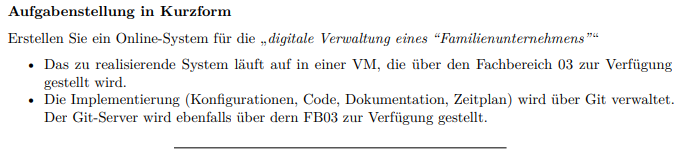

# Report Luigi's Solution Hub (Gruppe 6) 10.1.2025

## Integration des DeadDrop-Systems in unseres System

Da uns das tiefgründigere DeadDrop-System dieser Gruppe sehr schlüssig erschien, da es ermöglicht, eine Datei gezielt an eine bestimmte Person im Netzwerk zu senden, haben wir uns entschieden, dieses Feature in unser eigenes DeadDrop-System zu integrieren.

### 1. Schritt

Glücklicherweise stellte uns die Gruppe ihr DeadDrop.php-Skript zur Verfügung, damit wir es durchsehen und ähnliche Änderungen vornehmen konnten.

Wir nahmen folgende Änderungen an unserem eigenen Skript vor: 

 ```bash
<?php
/*
Plugin Name: Dead Drop System
Description: Sicheres System zum Hochladen und Herunterladen von Dateien mit Verschlüsselung, Benachrichtigungen und automatischer Löschung.
Version: 2.3
Author: Melina Gehlen
*/

defined('ABSPATH') || exit; // Sicherheitsmaßnahme, um direkten Zugriff auf diese Datei zu verhindern

// Shortcode für das Dead Drop System
add_shortcode('dead_drop', 'dead_drop_handler');

// Diese Funktion generiert die Benutzeroberfläche für das Dead Drop System.
function dead_drop_handler() {
    ob_start(); // Output-Buffering starten

    $current_user = wp_get_current_user(); // Details des aktuell eingeloggten Benutzers abrufen

    // Formular zum Hochladen von Dateien
    echo '<h2>Eine Datei sicher senden</h2>';
    if (isset($_POST['upload_file']) && isset($_FILES['file_upload'])) {
        // Datei-Upload behandeln und eine Nachricht anzeigen
        $upload_message = handle_file_upload();
        echo '<p style="color: green;">' . esc_html($upload_message) . '</p>';
    }
    ?>
    <!-- Formular für den Upload von Dateien, um sie an andere Benutzer zu senden -->
    <form method="POST" enctype="multipart/form-data">
        <?php wp_nonce_field('dead_drop_upload_nonce'); ?> <!-- Nonce für Sicherheit -->
        <label for="recipient">Datei senden an:</label><br>
        <select id="recipient" name="recipient" required>
            <option value="" disabled selected>Wähle einen Benutzer</option>
            <?php
            // Dropdown-Liste mit allen Benutzern außer dem aktuellen Benutzer befüllen
            $users = get_users();
            foreach ($users as $user) {
                if ($user->ID != $current_user->ID) { // Aktuellen Benutzer ausschließen
                    echo '<option value="' . esc_attr($user->ID) . '">' . esc_html($user->display_name) . '</option>';
                }
            }
            ?>
        </select><br><br>
        <label for="file_upload">Datei auswählen (PDF, max. 250MB):</label><br>
        <input type="file" name="file_upload" required><br><br>
        <button type="submit" name="upload_file">Hochladen</button>
    </form>
    <?php

    // Liste der Dateien anzeigen, die der eingeloggte Benutzer empfangen hat
    echo '<h2>Ihre empfangenen Dateien</h2>';
    $received_files = get_received_files($current_user->ID); // Dateien für den aktuellen Benutzer abrufen
    if (!empty($received_files)) {
        foreach ($received_files as $file) {
            // Optionen anzeigen, um die Datei anzusehen oder zu löschen
            $file_name = esc_html($file['name']);
            $view_url = esc_url(add_query_arg(['action' => 'view', 'file' => urlencode($file['path'])], site_url()));
            $delete_url = esc_url(add_query_arg(['action' => 'delete', 'file' => urlencode($file['path'])], site_url()));

            echo "<p>$file_name - <a href='$view_url' target='_blank'>Ansehen</a> | <a href='$delete_url'>Löschen</a></p>";
        }
    } else {
        echo '<p>Keine empfangenen Dateien.</p>'; // Den Benutzer informieren, wenn keine Dateien verfügbar sind
    }

    return ob_get_clean(); // Den zwischengespeicherten Inhalt zurückgeben
}

// Diese Funktion behandelt die Logik für das Hochladen von Dateien
function handle_file_upload() {
    $current_user = wp_get_current_user(); // Aktuellen Benutzer abrufen

    // Nonce-Überprüfung für Sicherheit
    if (!isset($_POST['_wpnonce']) || !wp_verify_nonce($_POST['_wpnonce'], 'dead_drop_upload_nonce')) {
        return "Sicherheitsüberprüfung fehlgeschlagen.";
    }

    if ($_FILES['file_upload']['error'] === UPLOAD_ERR_OK) {
        // Dateigröße und -typ validieren
        $max_file_size = 250 * 1024 * 1024; // Limit auf 250MB setzen
        $allowed_types = ['image/jpeg', 'image/png', 'application/pdf', 'text/plain']; // Erlaubte Dateitypen
        $file_type = mime_content_type($_FILES['file_upload']['tmp_name']);
        $file_size = $_FILES['file_upload']['size'];

        if ($file_size > $max_file_size) {
            return "Fehler: Datei überschreitet die Größe von 250MB."; // Fehler, wenn die Datei zu groß ist
        }
        if (!in_array($file_type, $allowed_types)) {
            return "Fehler: Nur PDF-, JPG- und PNG-Dateien sind erlaubt."; // Fehler, wenn der Dateityp ungültig ist
        }

        // Empfänger validieren
        $recipient_id = intval($_POST['recipient']);
        $recipient = get_user_by('ID', $recipient_id); // Details des Empfängers abrufen
        if (!$recipient || $recipient_id == $current_user->ID) {
            return "Fehler: Ungültiger Empfänger."; // Sicherstellen, dass der Empfänger gültig ist und nicht der aktuelle Benutzer
        }

        // Verzeichnis für Uploads vorbereiten
        $upload_dir = wp_upload_dir();
        $target_dir = $upload_dir['basedir'] . '/dead-drop/'; // Eigenen Ordner für Dead Drop Dateien erstellen
        if (!is_dir($target_dir)) {
            if (!mkdir($target_dir, 0755, true)) {
                return "Fehler: Verzeichnis für Uploads konnte nicht erstellt werden.";
            }
        }

        // Datei bereinigen und zum Speichern vorbereiten
        $file_name = sanitize_file_name($_FILES['file_upload']['name']);
        $file_path = $target_dir . $recipient_id . '_' . $file_name;

        if (move_uploaded_file($_FILES['file_upload']['tmp_name'], $file_path)) {
            return "Datei erfolgreich hochgeladen und an " . esc_html($recipient->display_name) . " gesendet."; // Erfolgsnachricht
        } else {
            return "Fehler: Datei konnte nicht hochgeladen werden."; // Fehler, wenn der Upload fehlschlägt
        }
    } else {
        return "Fehler: Datei-Upload fehlgeschlagen."; // Fehler, wenn der Upload nicht erfolgreich ist
    }
}

// Ruft die Dateien ab, die ein bestimmter Benutzer empfangen hat
function get_received_files($user_id) {
    $upload_dir = wp_upload_dir();
    $target_dir = $upload_dir['basedir'] . '/dead-drop/';

    if (!is_dir($target_dir)) {
        return []; // Leeres Array zurückgeben, wenn das Verzeichnis nicht existiert
    }

    // Verzeichnis nach Dateien durchsuchen, die dem Benutzer gehören
    $files = glob($target_dir . $user_id . '_*');
    $received_files = [];
    foreach ($files as $file) {
        $received_files[] = [
            'path' => $file,
            'name' => basename($file) // Dateiname für die Anzeige extrahieren
        ];
    }
    return $received_files;
}

// Behandelt Dateiaktionen wie Anzeigen oder Löschen
add_action('template_redirect', 'dead_drop_file_actions');
function dead_drop_file_actions() {
    if (isset($_GET['action']) && isset($_GET['file'])) {
        $file = urldecode($_GET['file']);
        $current_user = wp_get_current_user(); // Aktuellen Benutzer abrufen

        if (file_exists($file)) {
            // Überprüfen, ob der Benutzer Eigentümer der Datei ist
            $file_name = basename($file);
            $file_owner_id = intval(explode('_', $file_name)[0]);

            if ($file_owner_id === $current_user->ID) {
                if ($_GET['action'] === 'view') {
                    // Datei zur Ansicht bereitstellen
                    header('Content-Type: application/pdf');
                    readfile($file);
                    unlink($file); // Nach dem Anzeigen automatisch löschen
                    exit;
                } elseif ($_GET['action'] === 'delete') {
                    // Datei löschen
                    unlink($file);
                    wp_redirect(remove_query_arg(['action', 'file'])); // Nach dem Löschen zurückleiten
                    exit;
                }
            } else {
                wp_die('Sie sind nicht berechtigt, diese Aktion durchzuführen.'); // Fehler, wenn der Benutzer die Datei nicht besitzt
            }
        } else {
            wp_die('Datei nicht gefunden.'); // Fehler, wenn die Datei nicht existiert
        }
    }
}


```

## 2. Schritt 

Das erstellte PHP-Skript kann anschließend in einen ZIP-Ordner komprimiert werden. Diese ZIP-Datei wird dann über das WordPress-Dashboard unter Plugins hochgeladen und aktiviert.

## 3. Schritt 

Nach der erfolgreichen Aktivierung des Plugins wird das DeadDrop-System mithilfe des Shortcodes [dead_drop] auf unserere geschützte Seite integriert.

## Allgemeine Verbesserungsvorschläge 


### Hosten über XAMPP (lokal)

Das Problem hierbei liegt darin, dass das System lokal über XAMPP gehostet wird, wodurch ein Single Point of Failure entsteht. Zudem kann man schlussfolgern, dass die Seite nicht SSL-zertifiziert ist (was in diesem Fall nicht notwendig ist, da sie lokal ist). Mitglieder können nicht darauf zugreifen, ohne alles lokal zu installieren, was die Verfügbarkeit erheblich einschränkt. Wenn die Website wächst, kann der Server außerdem überlastet werden, was zu Ausfällen oder langsamen Ladezeiten führt.

Laut der Aufgabenstellung sollte das System in einer VM aufgesetzt werden, jedoch wurde es leider nur auf einem lokalen Windows System implementiert. Die Anleitung ist ebenfalls für eine Windows-Umgebung geschrieben. 

{ width=50% }

### HoneyPot 

Der HoneyPot ist nicht irreführend und weckt kein Interesse beim Angreifer, da er nicht der Haupt-Login der Seite ist (nicht das Erste, was sichtbar ist). Eine mögliche Verbesserung wäre, den HoneyPot auf der Homepage zu platzieren und den echten Login auf einer anderen Unterseite anzubieten. Sie könnten ebenfalls eine Ordnerstruktur erstellen.

Außerdem werden die IP-Adressen nicht mitgeloggt. Diese wären nützlich, um IP-Adressen zu blockieren oder Reverse-Engineering zu betreiben.
{ width=50% }

### Liebe zum Design 

Unserer Meinung nach ist die gewünschte ‚illegale‘ Seite nicht versteckt – man wird direkt zur Login-Seite weitergeleitet, sobald man die URL eingegeben hat. Zwar erweckt die Seite nicht direkt den Eindruck, dass sich hinter dem Login etwas anderes abspielt, jedoch hätte man in diesem Punkt kreativer sein können.

## Stärken 

### Anleitung

Die Anleitung war klar strukturiert und gut verständlich. Sie war so aufgebaut, dass alle relevanten Schritte in einer logischen Reihenfolge präsentiert wurden, was es einfach machte, den Prozess nachzuvollziehen. Die Verwendung von kurzen, prägnanten Sätzen und klaren Anweisungen trug dazu bei, dass man ohne Schwierigkeiten der Anleitung folgen konnte. Insgesamt wurde die Benutzerfreundlichkeit durch eine übersichtliche Gliederung und eine klare Sprache sehr schön herausgearbeitet, wodurch der gesamte Ablauf effizient und stressfrei durchgeführt werden konnte.

### Integrierte Features 

Das DeadDrop-System und der Chat haben einen besonders positiven Eindruck hinterlassen, da sie sowohl in ihrem Design als auch in ihrer Implementierung eine hohe Benutzerfreundlichkeit aufwiesen. Das Design war übersichtlich und intuitiv, was den Nutzern ermöglichte, schnell und ohne lange Einarbeitung die gewünschten Funktionen zu nutzen. Alle Plugins, die in das System integriert wurden, wurden zudem selbst erstellt, was einen hohen Aufwand und umfassendes Know-how beweist.

